# Airline Statistics | Communicate Data Findings

## Table of Contents
- [Introduction](#intro)
- [Step 1: Importing Libraries](#import)
- [Step 2: Gathering Data](#gather)
- [Step 3: Univariate Exploration](#univariate)
- [Step 4: Bivariate Exploration](#bivariate)
- [Step 5: Multivariate Exploration](#multivariate)
- [Step 6: Random Exploration](#random)
- [Step 7: Conclusion](#conclusion)


```python
from PIL import Image # Library for importing images
Image.open('images/airline_cover.jpg')
```


<a id='intro'></a>
## Introduction

#### What is the ASA?

ASA stands for 'American Statistical Association', ASA is the main professional organsiation for statisticians in the United States. The organization was formed in November 1839 and is the second oldest continuously operating professional society in the United States. Every other year, at the Joint Statistical Meetings, the Graphics Section and the Computing Section join in sponsoring a special Poster Session called The Data Exposition , but more commonly known as The Data Expo. All of the papers presented in this Poster Session are reports of analyses of a common data set provided for the occasion. In addition, all papers presented in the session are encouraged to report the use of graphical methods employed during the development of their analysis and to use graphics to convey their findings.

Quoted from citation: https://www.tandfonline.com/doi/abs/10.1198/jcgs.2011.1de

#### What is the ASA 2009 Data Expo?

The ASA Statistical Computing and Graphics Data Expo is a biannual data exploration challenge. Participants are challenged to provide a graphical summary of important features of the data. The task is intentionally vague to allow different entries to focus on different aspects of the data, giving the participants maximum freedom to apply their skills. The 2009 data expo consisted of flight arrival and departure details for all commercial flights on major carriers within the USA, from October 1987 to April 2008. This is a large dataset: there are nearly 120 million records in total, and takes up 1.6 gigabytes of space compressed and 12 gigabytes when uncompressed. The complete dataset and challenge are available on the competition website http://stat-computing.org/dataexpo/2009/.

Because the dataset is so large, we also provided participants introductions to useful tools for dealing with this scale of data: Linux command line tools, including sort, awk, and cut, and sqlite, a simple SQL database. Additionally, we provided pointers to supplemental data on airport locations, airline carrier codes, individual plane information, and weather.
This dataset reports flights in the United States, including carriers, arrival and departure delays, and reasons for delays, from 1987 to 2008.

Quoted from citation: https://www.tandfonline.com/doi/abs/10.1198/jcgs.2011.1de

#### Project Aims

This dataset reports flights in the United States, including carriers, arrival and departure delays, and reasons for delays, from 1987 to 2008. For our analysis, we are going to be using the three year period between 1989 to 1991 as our sample dataset as the whole dataset is too large to practically observe with Jupyter. Our goal is to ask many questions such as:

- How many flights are there?
- Which airlines have the most flights?
- What time of the week passengers fly the most?
- How does season change the frequency and the destination of travel?
- Which routes are the most popular?
- Which routes and airports experience the most delays?
- Which airports are the busiest in terms of inbound and outbound flights?
- Which popular routes are delayed the most?
- Which times are airports the busiest in terms of flights by each hour?
- How does flight distance affect departure and arrival delays?
- Which airline experiences the fewest delays?

**Table column descriptions:**


```python
import pandas as pd
pd.read_csv('misc_data/master/variable-descriptions_master.csv')
```


<div>
<style scoped>
    .dataframe tbody tr th:only-of-type {
        vertical-align: middle;
    }

    .dataframe tbody tr th {
        vertical-align: top;
    }

    .dataframe thead th {
        text-align: right;
    }
</style>
<table border="1" class="dataframe">
  <thead>
    <tr style="text-align: right;">
      <th></th>
      <th>name</th>
      <th>description</th>
    </tr>
  </thead>
  <tbody>
    <tr>
      <th>0</th>
      <td>Year</td>
      <td>1987-2008</td>
    </tr>
    <tr>
      <th>1</th>
      <td>Month</td>
      <td>12-Jan</td>
    </tr>
    <tr>
      <th>2</th>
      <td>DayofMonth</td>
      <td>31-Jan</td>
    </tr>
    <tr>
      <th>3</th>
      <td>DayOfWeek</td>
      <td>1 (Monday) - 7 (Sunday)</td>
    </tr>
    <tr>
      <th>4</th>
      <td>DepTime</td>
      <td>actual departure time (local, hhmm)</td>
    </tr>
    <tr>
      <th>5</th>
      <td>CRSDepTime</td>
      <td>scheduled departure time (local, hhmm)</td>
    </tr>
    <tr>
      <th>6</th>
      <td>ArrTime</td>
      <td>actual arrival time (local, hhmm)</td>
    </tr>
    <tr>
      <th>7</th>
      <td>CRSArrTime</td>
      <td>scheduled arrival time (local, hhmm)</td>
    </tr>
    <tr>
      <th>8</th>
      <td>UniqueCarrier</td>
      <td>unique carrier code</td>
    </tr>
    <tr>
      <th>9</th>
      <td>FlightNum</td>
      <td>flight number</td>
    </tr>
    <tr>
      <th>10</th>
      <td>TailNum</td>
      <td>plane tail number</td>
    </tr>
    <tr>
      <th>11</th>
      <td>ActualElapsedTime</td>
      <td>in minutes</td>
    </tr>
    <tr>
      <th>12</th>
      <td>CRSElapsedTime</td>
      <td>in minutes</td>
    </tr>
    <tr>
      <th>13</th>
      <td>AirTime</td>
      <td>in minutes</td>
    </tr>
    <tr>
      <th>14</th>
      <td>ArrDelay</td>
      <td>arrival delay, in minutes</td>
    </tr>
    <tr>
      <th>15</th>
      <td>DepDelay</td>
      <td>departure delay, in minutes</td>
    </tr>
    <tr>
      <th>16</th>
      <td>Origin</td>
      <td>origin IATA airport code</td>
    </tr>
    <tr>
      <th>17</th>
      <td>Dest</td>
      <td>destination IATA airport code</td>
    </tr>
    <tr>
      <th>18</th>
      <td>Distance</td>
      <td>in miles</td>
    </tr>
    <tr>
      <th>19</th>
      <td>TaxiIn</td>
      <td>taxi in time, in minutes</td>
    </tr>
    <tr>
      <th>20</th>
      <td>TaxiOut</td>
      <td>taxi out time in minutes</td>
    </tr>
    <tr>
      <th>21</th>
      <td>Cancelled</td>
      <td>was the flight cancelled?</td>
    </tr>
    <tr>
      <th>22</th>
      <td>CancellationCode</td>
      <td>reason for cancellation (A = carrier, B = weat...</td>
    </tr>
    <tr>
      <th>23</th>
      <td>Diverted</td>
      <td>1 = yes, 0 = no</td>
    </tr>
    <tr>
      <th>24</th>
      <td>CarrierDelay</td>
      <td>in minutes</td>
    </tr>
    <tr>
      <th>25</th>
      <td>WeatherDelay</td>
      <td>in minutes</td>
    </tr>
    <tr>
      <th>26</th>
      <td>NASDelay</td>
      <td>in minutes</td>
    </tr>
    <tr>
      <th>27</th>
      <td>SecurityDelay</td>
      <td>in minutes</td>
    </tr>
    <tr>
      <th>28</th>
      <td>LateAircraftDelay</td>
      <td>in minutes</td>
    </tr>
  </tbody>
</table>
</div>


<a id='import'></a>
## Step 1: Import 📚


```python
# Import libraries
import pandas as pd
import numpy as np
import datetime as dt
import markdown
import seaborn as sb
import matplotlib.pyplot as plt
import matplotlib.ticker as tick
%matplotlib inline

# Display dataframe all columns
pd.set_option('display.max_rows', 636)
pd.set_option('display.max_columns', 636)
```

**References:** \
https://unicode.org/emoji/charts/full-emoji-list.html \
https://getemoji.com/


```python
# Formatting ticks for large values (this will change the large numbers in charts to short clean values)
def reformat_large_tick_values(tick_val, pos):
    """
    Turns large tick values (in the billions, millions and thousands) such as 4500 into 4.5K and also appropriately turns 4000 into 4K (no zero after the decimal).
    """
    if tick_val >= 1000000000:
        val = round(tick_val/1000000000, 1)
        new_tick_format = '{:}B'.format(val)
    elif tick_val >= 1000000:
        val = round(tick_val/1000000, 1)
        new_tick_format = '{:}M'.format(val)
    elif tick_val >= 1000:
        val = round(tick_val/1000, 1)
        new_tick_format = '{:}K'.format(val)
    elif tick_val < 1000:
        new_tick_format = round(tick_val, 1)
    else:
        new_tick_format = tick_val

    # make new_tick_format into a string value
    new_tick_format = str(new_tick_format)
    
    # code below will keep 4.5M as is but change values such as 4.0M to 4M since that zero after the decimal isn't needed
    index_of_decimal = new_tick_format.find(".")
    
    if index_of_decimal != -1:
        value_after_decimal = new_tick_format[index_of_decimal+1]
        if value_after_decimal == "0":
            # remove the 0 after the decimal point since it's not needed
            new_tick_format = new_tick_format[0:index_of_decimal] + new_tick_format[index_of_decimal+2:]
            
    return new_tick_format
```

<a id='gather'></a>
## Step 2: Gather 💾


```python
# flight data
df8991 = pd.read_csv('dataset/1989-1991.csv')
```


```python
# misc_data
airports = pd.read_csv('misc_data/master/airports_master.csv')
carriers = pd.read_csv('misc_data/master/carriers_master.csv')
plane_data = pd.read_csv('misc_data/master/plane-data_master.csv')
var_desc = pd.read_csv('misc_data/master/variable-descriptions_master.csv')
```


```python
df8991.info()
```

    <class 'pandas.core.frame.DataFrame'>
    RangeIndex: 15031014 entries, 0 to 15031013
    Data columns (total 17 columns):
    Date                 object
    DayOfWeek            object
    DepTime              object
    CRSDepTime           object
    ArrTime              object
    CRSArrTime           object
    UniqueCarrier        object
    FlightNum            int64
    ActualElapsedTime    int64
    CRSElapsedTime       int64
    ArrDelay             int64
    DepDelay             int64
    Origin               object
    Dest                 object
    Distance             int64
    Cancelled            int64
    Diverted             int64
    dtypes: int64(8), object(9)
    memory usage: 1.9+ GB
    


```python
# Converting date column
df8991['Date'] = pd.to_datetime(df8991['Date'])
```


```python
from PIL import Image # Library for importing images
Image.open('images/Boeing_727-22_United_Airlines.jpg')
```


<a id='univariate'></a>
## Step 3: Univariate Exploration 📈

During this step, we will investigate distributions of individual variables to prepare for observing the relationships between variables.


```python
df8991.head(10)
```


<div>
<style scoped>
    .dataframe tbody tr th:only-of-type {
        vertical-align: middle;
    }

    .dataframe tbody tr th {
        vertical-align: top;
    }

    .dataframe thead th {
        text-align: right;
    }
</style>
<table border="1" class="dataframe">
  <thead>
    <tr style="text-align: right;">
      <th></th>
      <th>Date</th>
      <th>DayOfWeek</th>
      <th>DepTime</th>
      <th>CRSDepTime</th>
      <th>ArrTime</th>
      <th>CRSArrTime</th>
      <th>UniqueCarrier</th>
      <th>FlightNum</th>
      <th>ActualElapsedTime</th>
      <th>CRSElapsedTime</th>
      <th>ArrDelay</th>
      <th>DepDelay</th>
      <th>Origin</th>
      <th>Dest</th>
      <th>Distance</th>
      <th>Cancelled</th>
      <th>Diverted</th>
    </tr>
  </thead>
  <tbody>
    <tr>
      <th>0</th>
      <td>1989-01-23</td>
      <td>Monday</td>
      <td>14:19:00</td>
      <td>12:30:00</td>
      <td>17:42:00</td>
      <td>15:52:00</td>
      <td>UA</td>
      <td>183</td>
      <td>323</td>
      <td>322</td>
      <td>110</td>
      <td>109</td>
      <td>SFO</td>
      <td>HNL</td>
      <td>2398</td>
      <td>0</td>
      <td>0</td>
    </tr>
    <tr>
      <th>1</th>
      <td>1989-01-24</td>
      <td>Tuesday</td>
      <td>12:55:00</td>
      <td>12:30:00</td>
      <td>16:12:00</td>
      <td>15:52:00</td>
      <td>UA</td>
      <td>183</td>
      <td>317</td>
      <td>322</td>
      <td>20</td>
      <td>25</td>
      <td>SFO</td>
      <td>HNL</td>
      <td>2398</td>
      <td>0</td>
      <td>0</td>
    </tr>
    <tr>
      <th>2</th>
      <td>1989-01-25</td>
      <td>Wednesday</td>
      <td>12:30:00</td>
      <td>12:30:00</td>
      <td>15:33:00</td>
      <td>15:52:00</td>
      <td>UA</td>
      <td>183</td>
      <td>303</td>
      <td>322</td>
      <td>-19</td>
      <td>0</td>
      <td>SFO</td>
      <td>HNL</td>
      <td>2398</td>
      <td>0</td>
      <td>0</td>
    </tr>
    <tr>
      <th>3</th>
      <td>1989-01-26</td>
      <td>Thursday</td>
      <td>12:30:00</td>
      <td>12:30:00</td>
      <td>15:23:00</td>
      <td>15:52:00</td>
      <td>UA</td>
      <td>183</td>
      <td>293</td>
      <td>322</td>
      <td>-29</td>
      <td>0</td>
      <td>SFO</td>
      <td>HNL</td>
      <td>2398</td>
      <td>0</td>
      <td>0</td>
    </tr>
    <tr>
      <th>4</th>
      <td>1989-01-27</td>
      <td>Friday</td>
      <td>12:32:00</td>
      <td>12:30:00</td>
      <td>15:13:00</td>
      <td>15:52:00</td>
      <td>UA</td>
      <td>183</td>
      <td>281</td>
      <td>322</td>
      <td>-39</td>
      <td>2</td>
      <td>SFO</td>
      <td>HNL</td>
      <td>2398</td>
      <td>0</td>
      <td>0</td>
    </tr>
    <tr>
      <th>5</th>
      <td>1989-01-28</td>
      <td>Saturday</td>
      <td>12:28:00</td>
      <td>12:30:00</td>
      <td>15:50:00</td>
      <td>15:52:00</td>
      <td>UA</td>
      <td>183</td>
      <td>322</td>
      <td>322</td>
      <td>-2</td>
      <td>-2</td>
      <td>SFO</td>
      <td>HNL</td>
      <td>2398</td>
      <td>0</td>
      <td>0</td>
    </tr>
    <tr>
      <th>6</th>
      <td>1989-01-29</td>
      <td>Sunday</td>
      <td>16:39:00</td>
      <td>12:30:00</td>
      <td>19:42:00</td>
      <td>15:52:00</td>
      <td>UA</td>
      <td>183</td>
      <td>303</td>
      <td>322</td>
      <td>230</td>
      <td>249</td>
      <td>SFO</td>
      <td>HNL</td>
      <td>2398</td>
      <td>0</td>
      <td>0</td>
    </tr>
    <tr>
      <th>7</th>
      <td>1989-01-30</td>
      <td>Monday</td>
      <td>12:31:00</td>
      <td>12:30:00</td>
      <td>15:31:00</td>
      <td>15:52:00</td>
      <td>UA</td>
      <td>183</td>
      <td>300</td>
      <td>322</td>
      <td>-21</td>
      <td>1</td>
      <td>SFO</td>
      <td>HNL</td>
      <td>2398</td>
      <td>0</td>
      <td>0</td>
    </tr>
    <tr>
      <th>8</th>
      <td>1989-01-31</td>
      <td>Tuesday</td>
      <td>14:05:00</td>
      <td>12:30:00</td>
      <td>18:27:00</td>
      <td>15:52:00</td>
      <td>UA</td>
      <td>183</td>
      <td>382</td>
      <td>322</td>
      <td>155</td>
      <td>95</td>
      <td>SFO</td>
      <td>HNL</td>
      <td>2398</td>
      <td>0</td>
      <td>0</td>
    </tr>
    <tr>
      <th>9</th>
      <td>1989-01-02</td>
      <td>Monday</td>
      <td>10:57:00</td>
      <td>10:45:00</td>
      <td>15:37:00</td>
      <td>15:54:00</td>
      <td>UA</td>
      <td>184</td>
      <td>160</td>
      <td>189</td>
      <td>-17</td>
      <td>12</td>
      <td>DEN</td>
      <td>IAD</td>
      <td>1452</td>
      <td>0</td>
      <td>0</td>
    </tr>
  </tbody>
</table>
</div>


### 3.1. Total Flights by Month


```python
# Extracting the month number from the dates
flight_month = df8991['Date'].dt.month

# Assigning the months
months = ['Jan','Feb','Mar','Apr','May','Jun','Jul','Aug','Sep','Oct','Nov','Dec']

# Creating a new dataframe
flight_month = pd.DataFrame(flight_month)

# Renaming the column name of the new dataframe
flight_month.rename(columns = {'Date':'Month'},inplace=True)

# Adding a new column to count flights per month
flight_month['Flights'] = df8991['Date'].dt.month.count

# Grouping the data by month then assigning month names to 'month' column
month_data  = flight_month.groupby('Month').count()
month_data['Month'] = months

# Renaming each month number to a real month name
flights_by_month = month_data.rename(index={1: 'Jan', 2: 'Feb', 3: 'Mar', 4: 'Apr', 5: 'May', 6: 'Jun', 7: 'Jul', 8: 'Aug', 9: 'Sep', 10: 'Oct', 11: 'Nov', 12: 'Dec'})
flights_by_month.drop(columns=['Month'], axis=1, inplace=True)

# Looking at the dataframe we created
flights_by_month
```


<div>
<style scoped>
    .dataframe tbody tr th:only-of-type {
        vertical-align: middle;
    }

    .dataframe tbody tr th {
        vertical-align: top;
    }

    .dataframe thead th {
        text-align: right;
    }
</style>
<table border="1" class="dataframe">
  <thead>
    <tr style="text-align: right;">
      <th></th>
      <th>Flights</th>
    </tr>
    <tr>
      <th>Month</th>
      <th></th>
    </tr>
  </thead>
  <tbody>
    <tr>
      <th>Jan</th>
      <td>1223834</td>
    </tr>
    <tr>
      <th>Feb</th>
      <td>1102190</td>
    </tr>
    <tr>
      <th>Mar</th>
      <td>1271415</td>
    </tr>
    <tr>
      <th>Apr</th>
      <td>1250728</td>
    </tr>
    <tr>
      <th>May</th>
      <td>1281666</td>
    </tr>
    <tr>
      <th>Jun</th>
      <td>1255135</td>
    </tr>
    <tr>
      <th>Jul</th>
      <td>1299911</td>
    </tr>
    <tr>
      <th>Aug</th>
      <td>1312995</td>
    </tr>
    <tr>
      <th>Sep</th>
      <td>1254058</td>
    </tr>
    <tr>
      <th>Oct</th>
      <td>1297516</td>
    </tr>
    <tr>
      <th>Nov</th>
      <td>1224153</td>
    </tr>
    <tr>
      <th>Dec</th>
      <td>1257413</td>
    </tr>
  </tbody>
</table>
</div>


```python
# Total flights
flights_by_month['Flights'].sum()
```


    15031014


```python
# Average flights per month
flights_by_month['Flights'].mean()
```


    1252584.5


```python
# Working out percentage of flights in 'Feb' compared to the monthly average
round(flights_by_month.loc['Feb','Flights']/flights_by_month['Flights'].mean()-1, 2)
```


    -0.12


```python
# Plot
flights_by_month.plot(kind = 'bar', figsize=(10, 5), rot=0, legend=None)

# Set title label
plt.title('Total Flights by Month', fontsize = 15)

# Set axis labels
plt.ylabel('', fontsize = 13)
plt.xlabel('', fontsize = 13)

# Ticks
ax = plt.gca()
ax.yaxis.set_major_formatter(tick.FuncFormatter(reformat_large_tick_values));

# Show
plt.tight_layout(pad=1)
plt.savefig('images/charts/total_flights_by_month.png')
plt.show()
```


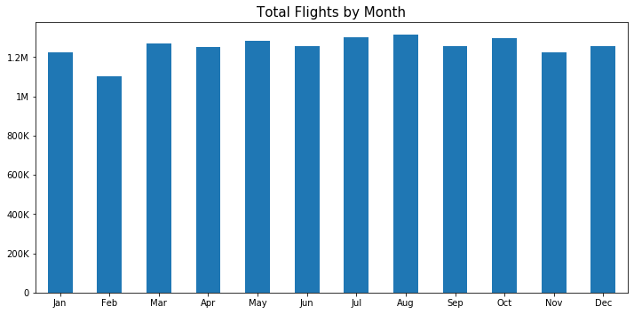


**Observation 1:** For this dataset we have used the data between 1989-1991, therefore we grouped the data into monthly averages between those years. can see August has the most flights on average and Feburary had the least. This shows us that summer months have the most flights and winter months the least. Feburary had 12% less flights compared to the monthly average of 1,252,585.

### 3.2. Total Flights by Season


```python
# Create new dataframe
flights_by_season = flights_by_month
flights_by_season = month_data.rename(index={1: 'Winter', 2: 'Winter', 3: 'Spring', 4: 'Spring', 5: 'Spring', 6: 'Summer', 7: 'Summer', 8: 'Summer', 9: 'Autumn', 10: 'Autumn', 11: 'Autumn', 12: 'Winter'})

# Drop 'Month' column
flights_by_season.drop(columns=['Month'], axis=1, inplace=True)

# Group seasons
flights_by_season.rename_axis(index={'Month':'Season'}, inplace=True)
flights_by_season.reset_index(inplace=True)
flights_by_season = flights_by_season.groupby('Season').sum()

# Order index
flights_by_season = flights_by_season.reindex(['Spring', 'Summer', 'Autumn', 'Winter'])

# Looking at the dataframe we created
flights_by_season
```


<div>
<style scoped>
    .dataframe tbody tr th:only-of-type {
        vertical-align: middle;
    }

    .dataframe tbody tr th {
        vertical-align: top;
    }

    .dataframe thead th {
        text-align: right;
    }
</style>
<table border="1" class="dataframe">
  <thead>
    <tr style="text-align: right;">
      <th></th>
      <th>Flights</th>
    </tr>
    <tr>
      <th>Season</th>
      <th></th>
    </tr>
  </thead>
  <tbody>
    <tr>
      <th>Spring</th>
      <td>3803809</td>
    </tr>
    <tr>
      <th>Summer</th>
      <td>3868041</td>
    </tr>
    <tr>
      <th>Autumn</th>
      <td>3775727</td>
    </tr>
    <tr>
      <th>Winter</th>
      <td>3583437</td>
    </tr>
  </tbody>
</table>
</div>


```python
flights_by_season['Flights'].pct_change(periods=1)
```


    Season
    Spring         NaN
    Summer    0.016886
    Autumn   -0.023866
    Winter   -0.050928
    Name: Flights, dtype: float64


```python
# Plot
flights_by_season.plot(kind = 'bar', figsize=(7, 5), rot=0, legend=None)

# Set title label
plt.title('Total Flights by Season', fontsize = 15)

# Set axis labels
plt.ylabel('Number of flights', fontsize = 13)
plt.xlabel('', fontsize = 13)

# Ticks
ax = plt.gca()
ax.yaxis.set_major_formatter(tick.FuncFormatter(reformat_large_tick_values));

# Show
plt.tight_layout(pad=1)
plt.savefig('images/charts/total_flights_by_season.png')
plt.show()
```


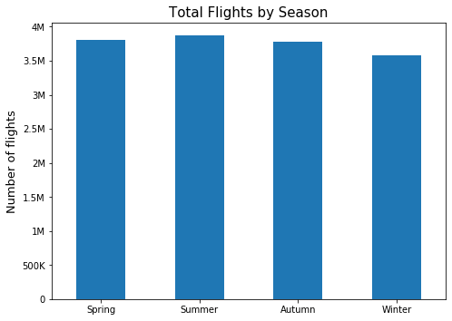


**Observation 2:** Summer has the most total flights but the difference between them is not as much as you might think. From my calculations, the percentage difference between the best and worst seasons is only 5%. Spring has a strong performance placing 2nd, Autumn 3rd and Winter a more distant 4th.

### 3.3. Total Flights by Day


```python
# Extracting the day number from the dates
flight_day = df8991['Date'].dt.dayofweek 

# Assigning the days
days = ['Mon', 'Tue', 'Wed', 'Thu', 'Fri', 'Sat', 'Sun']

# Creating a new dataframe
flight_day = pd.DataFrame(flight_day)

# Renaming the column name of the new dataframe
flight_day.rename(columns = {'Date':'Day'},inplace=True)

# Adding a new column to count flights per day
flight_day['Flights'] = df8991['Date'].dt.dayofweek.count

# Grouping the data by day
day_data  = flight_day.groupby('Day').count()
day_data['Day'] = days

# Renaming each day number to a real day name
flights_by_day = day_data.rename(index={0: 'Mon', 1: 'Tue', 2: 'Wed', 3: 'Thu', 4: 'Fri', 5: 'Sat', 6: 'Sun'})
flights_by_day.drop(columns=['Day'], axis=1, inplace=True)

# Looking at the dataframe we created
flights_by_day
```


<div>
<style scoped>
    .dataframe tbody tr th:only-of-type {
        vertical-align: middle;
    }

    .dataframe tbody tr th {
        vertical-align: top;
    }

    .dataframe thead th {
        text-align: right;
    }
</style>
<table border="1" class="dataframe">
  <thead>
    <tr style="text-align: right;">
      <th></th>
      <th>Flights</th>
    </tr>
    <tr>
      <th>Day</th>
      <th></th>
    </tr>
  </thead>
  <tbody>
    <tr>
      <th>Mon</th>
      <td>2211445</td>
    </tr>
    <tr>
      <th>Tue</th>
      <td>2210868</td>
    </tr>
    <tr>
      <th>Wed</th>
      <td>2200217</td>
    </tr>
    <tr>
      <th>Thu</th>
      <td>2186411</td>
    </tr>
    <tr>
      <th>Fri</th>
      <td>2180619</td>
    </tr>
    <tr>
      <th>Sat</th>
      <td>1964556</td>
    </tr>
    <tr>
      <th>Sun</th>
      <td>2076898</td>
    </tr>
  </tbody>
</table>
</div>


```python
flights_by_day['Flights'].pct_change()
```


    Day
    Mon         NaN
    Tue   -0.000261
    Wed   -0.004818
    Thu   -0.006275
    Fri   -0.002649
    Sat   -0.099083
    Sun    0.057184
    Name: Flights, dtype: float64


```python
# Average flights per day
round(flights_by_day['Flights'].mean(), 2)
```


    2147287.71


```python
# Working out percentage of flights compared to the weekly average
round(flights_by_day.loc['Sat','Flights']/flights_by_day['Flights'].mean()-1, 2)
```


    -0.09


```python
# Plot
flights_by_day.reindex(index=flights_by_day.index[::-1]).plot(kind = 'barh', figsize=(10, 5), rot=0)

# Set title label
plt.title('Total Flights by Day', fontsize = 15)

# Set axis labels
plt.ylabel('', fontsize = 13)
plt.xlabel('', fontsize = 13)

# Ticks
ax = plt.gca()
ax.xaxis.set_major_formatter(tick.FuncFormatter(reformat_large_tick_values));
ax.axvline(flights_by_day['Flights'].mean(), color='red', linewidth=2, linestyle='dashed', label='Average')

# Legend
plt.legend(bbox_to_anchor=(1.2, 1), loc=1, borderaxespad=0.0)

# Show
plt.tight_layout(pad=1)
plt.savefig('images/charts/total_flights_by_day.png')
plt.show()
```


**Observation 3:** Monday has the most total flights with 2,211,445 but the difference between Monday and the other weekdays is rather negligable. Saturday shows a near 10% dip in flights compared to Monday while Sunday dips under 6% using the same comparison, this suggests passengers are flying more during the week than weekends. This chart shows a 10% variance between the day with the highest and lowest amount of flights, 3 years of data shows consistency in strong demand for flights regardless of the day of the week.

### 3.4. Total Flights by Hour


```python
# Creating flight_hour
flight_hour = df8991['DepTime']

# Creating a new dataframe
flight_hour = pd.DataFrame(flight_hour)

# Extracting the hour from the times
flight_hour['FlightHour'] = df8991['DepTime'].str[:2]

# Adding a new column to count flights per hour
flight_hour['Flights'] = flight_hour['FlightHour'].count

# Drop column
flight_hour.drop(columns=['DepTime'], axis=1, inplace=True)

# Grouping the data by hour
hour_data  = flight_hour.groupby('FlightHour').count()
flights_by_hour = hour_data

# Looking at the dataframe we created
flights_by_hour
```


<div>
<style scoped>
    .dataframe tbody tr th:only-of-type {
        vertical-align: middle;
    }

    .dataframe tbody tr th {
        vertical-align: top;
    }

    .dataframe thead th {
        text-align: right;
    }
</style>
<table border="1" class="dataframe">
  <thead>
    <tr style="text-align: right;">
      <th></th>
      <th>Flights</th>
    </tr>
    <tr>
      <th>FlightHour</th>
      <th></th>
    </tr>
  </thead>
  <tbody>
    <tr>
      <th>00</th>
      <td>61648</td>
    </tr>
    <tr>
      <th>01</th>
      <td>46131</td>
    </tr>
    <tr>
      <th>02</th>
      <td>8595</td>
    </tr>
    <tr>
      <th>03</th>
      <td>2593</td>
    </tr>
    <tr>
      <th>04</th>
      <td>5505</td>
    </tr>
    <tr>
      <th>05</th>
      <td>53452</td>
    </tr>
    <tr>
      <th>06</th>
      <td>779935</td>
    </tr>
    <tr>
      <th>07</th>
      <td>1049654</td>
    </tr>
    <tr>
      <th>08</th>
      <td>1103998</td>
    </tr>
    <tr>
      <th>09</th>
      <td>976624</td>
    </tr>
    <tr>
      <th>10</th>
      <td>834899</td>
    </tr>
    <tr>
      <th>11</th>
      <td>915756</td>
    </tr>
    <tr>
      <th>12</th>
      <td>977161</td>
    </tr>
    <tr>
      <th>13</th>
      <td>1032993</td>
    </tr>
    <tr>
      <th>14</th>
      <td>845945</td>
    </tr>
    <tr>
      <th>15</th>
      <td>882206</td>
    </tr>
    <tr>
      <th>16</th>
      <td>934469</td>
    </tr>
    <tr>
      <th>17</th>
      <td>988229</td>
    </tr>
    <tr>
      <th>18</th>
      <td>973944</td>
    </tr>
    <tr>
      <th>19</th>
      <td>842436</td>
    </tr>
    <tr>
      <th>20</th>
      <td>798213</td>
    </tr>
    <tr>
      <th>21</th>
      <td>503912</td>
    </tr>
    <tr>
      <th>22</th>
      <td>275905</td>
    </tr>
    <tr>
      <th>23</th>
      <td>136811</td>
    </tr>
  </tbody>
</table>
</div>


```python
# Most popular flight hours
flights_by_hour.sort_values(by='Flights', ascending=False).head(5)
```


<div>
<style scoped>
    .dataframe tbody tr th:only-of-type {
        vertical-align: middle;
    }

    .dataframe tbody tr th {
        vertical-align: top;
    }

    .dataframe thead th {
        text-align: right;
    }
</style>
<table border="1" class="dataframe">
  <thead>
    <tr style="text-align: right;">
      <th></th>
      <th>Flights</th>
    </tr>
    <tr>
      <th>FlightHour</th>
      <th></th>
    </tr>
  </thead>
  <tbody>
    <tr>
      <th>08</th>
      <td>1103998</td>
    </tr>
    <tr>
      <th>07</th>
      <td>1049654</td>
    </tr>
    <tr>
      <th>13</th>
      <td>1032993</td>
    </tr>
    <tr>
      <th>17</th>
      <td>988229</td>
    </tr>
    <tr>
      <th>12</th>
      <td>977161</td>
    </tr>
  </tbody>
</table>
</div>


```python
# Least popular flight hours 
flights_by_hour.sort_values(by='Flights', ascending=True).head(5)
```


<div>
<style scoped>
    .dataframe tbody tr th:only-of-type {
        vertical-align: middle;
    }

    .dataframe tbody tr th {
        vertical-align: top;
    }

    .dataframe thead th {
        text-align: right;
    }
</style>
<table border="1" class="dataframe">
  <thead>
    <tr style="text-align: right;">
      <th></th>
      <th>Flights</th>
    </tr>
    <tr>
      <th>FlightHour</th>
      <th></th>
    </tr>
  </thead>
  <tbody>
    <tr>
      <th>03</th>
      <td>2593</td>
    </tr>
    <tr>
      <th>04</th>
      <td>5505</td>
    </tr>
    <tr>
      <th>02</th>
      <td>8595</td>
    </tr>
    <tr>
      <th>01</th>
      <td>46131</td>
    </tr>
    <tr>
      <th>05</th>
      <td>53452</td>
    </tr>
  </tbody>
</table>
</div>


```python
# Working out x difference in flights between busiest hour compared to the quietest hour
round(flights_by_hour.loc['08','Flights']/flights_by_hour.loc['03','Flights'], 2)
```


    425.76


```python
# Plot
flights_by_hour.plot(kind = 'bar', figsize=(10, 5), rot=0, legend=None)

# Set title label
plt.title('Total Flights by Hour', fontsize = 15)

# Set axis labels
plt.ylabel('', fontsize = 13)
plt.xlabel('', fontsize = 13)

# Ticks
ax = plt.gca()
ax.yaxis.set_major_formatter(tick.FuncFormatter(reformat_large_tick_values));

# Show
plt.tight_layout(pad=1)
plt.savefig('images/charts/total_flights_by_hour.png')
plt.show()
```


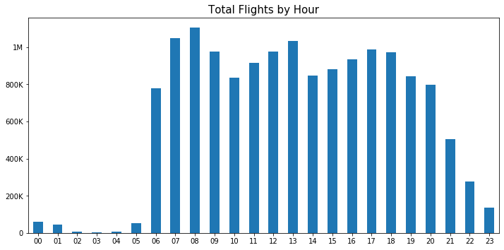


**Observation 4:** 08:00 is the most popular time to fly with 1,103,998 flights according to departure time data from 1989-1991. We can see that there is a dip at 10:00, perhaps due to scheduling or other external reasons. The next dip we see on the chart is at 14:00 hours before recovering again until 18:00 where the flights steadily drop off. 03:00 recorded the lowest number of flights at only 2,593, that is a -426x difference in total flights vs 08:00. Flights between midnight and 05:00 are lower due to many factors including being the time people are generally sleeping but also noise restrictions.

### 3.5. Flight Duration in Minutes


```python
df8991['ActualElapsedTime'].min(), df8991['ActualElapsedTime'].max()
```


    (-591, 1883)


```python
df8991['CRSElapsedTime'].min(), df8991['CRSElapsedTime'].max()
```


    (-59, 1565)


```python
df8991[df8991['CRSElapsedTime'] == -59]
```


<div>
<style scoped>
    .dataframe tbody tr th:only-of-type {
        vertical-align: middle;
    }

    .dataframe tbody tr th {
        vertical-align: top;
    }

    .dataframe thead th {
        text-align: right;
    }
</style>
<table border="1" class="dataframe">
  <thead>
    <tr style="text-align: right;">
      <th></th>
      <th>Date</th>
      <th>DayOfWeek</th>
      <th>DepTime</th>
      <th>CRSDepTime</th>
      <th>ArrTime</th>
      <th>CRSArrTime</th>
      <th>UniqueCarrier</th>
      <th>FlightNum</th>
      <th>ActualElapsedTime</th>
      <th>CRSElapsedTime</th>
      <th>ArrDelay</th>
      <th>DepDelay</th>
      <th>Origin</th>
      <th>Dest</th>
      <th>Distance</th>
      <th>Cancelled</th>
      <th>Diverted</th>
    </tr>
  </thead>
  <tbody>
    <tr>
      <th>13266400</th>
      <td>1991-08-08</td>
      <td>Thursday</td>
      <td>06:56:00</td>
      <td>07:00:00</td>
      <td>11:04:00</td>
      <td>07:01:00</td>
      <td>NW</td>
      <td>312</td>
      <td>188</td>
      <td>-59</td>
      <td>243</td>
      <td>-4</td>
      <td>MSP</td>
      <td>DCA</td>
      <td>931</td>
      <td>0</td>
      <td>0</td>
    </tr>
  </tbody>
</table>
</div>


```python
# Looking for 'ActualElapsedTime' values under 0
df8991['ActualElapsedTime'][df8991['ActualElapsedTime'] < 0].count()
```


    29


```python
# Looking for 'CRSElapsedTime' values under 0
df8991['CRSElapsedTime'][df8991['CRSElapsedTime'] < 0].count()
```


    12


```python
# Creating flight_duration and dropping time values under 0
flight_duration = df8991['ActualElapsedTime'][df8991['ActualElapsedTime'] >= 0]

# Creating a new dataframe
flight_duration = pd.DataFrame(flight_duration)

# Extracting the duration data
flight_duration['FlightDuration'] = df8991['ActualElapsedTime']

# Adding a new column to count flights by duration
flight_duration['Flights'] = flight_duration['FlightDuration'].count

# Drop column
flight_duration.drop(columns=['ActualElapsedTime'], axis=1, inplace=True)

# Grouping the data by duration
duration_data  = flight_duration.groupby('FlightDuration').count()
flights_by_duration = duration_data

# Looking at the dataframe we created
flights_by_duration.head()
```


<div>
<style scoped>
    .dataframe tbody tr th:only-of-type {
        vertical-align: middle;
    }

    .dataframe tbody tr th {
        vertical-align: top;
    }

    .dataframe thead th {
        text-align: right;
    }
</style>
<table border="1" class="dataframe">
  <thead>
    <tr style="text-align: right;">
      <th></th>
      <th>Flights</th>
    </tr>
    <tr>
      <th>FlightDuration</th>
      <th></th>
    </tr>
  </thead>
  <tbody>
    <tr>
      <th>0</th>
      <td>2</td>
    </tr>
    <tr>
      <th>1</th>
      <td>2</td>
    </tr>
    <tr>
      <th>2</th>
      <td>4</td>
    </tr>
    <tr>
      <th>3</th>
      <td>1</td>
    </tr>
    <tr>
      <th>4</th>
      <td>3</td>
    </tr>
  </tbody>
</table>
</div>


```python
# Average flight duration
df8991['ActualElapsedTime'][df8991['ActualElapsedTime'] > 0].mean()
```


    109.90256206131029


```python
# Median flight duration
df8991['ActualElapsedTime'][df8991['ActualElapsedTime'] > 0].median()
```


    91.0


```python
# Percentage of flights over 300 minutes
df8991['ActualElapsedTime'][df8991['ActualElapsedTime'] > 300].count()/df8991['ActualElapsedTime'].count()
```


    0.018513654501286475


```python
# Percentage of flights between 0 and 300 minutes
df8991['ActualElapsedTime'][df8991['ActualElapsedTime'].between(0, 300)].count()/df8991['ActualElapsedTime'].count()
```


    0.9814844161544923


```python
# Checking the statistics
df8991['ActualElapsedTime'][df8991['ActualElapsedTime'] > 0].describe()
```


    count    1.503098e+07
    mean     1.099026e+02
    std      6.445965e+01
    min      1.000000e+00
    25%      6.400000e+01
    50%      9.100000e+01
    75%      1.400000e+02
    max      1.883000e+03
    Name: ActualElapsedTime, dtype: float64


```python
# Maximum flight duration
df8991['ActualElapsedTime'].max()
```


    1883


```python
# Plot
flights_by_duration.plot(kind = 'area', figsize=(7, 5), rot=0, legend=None)

# Set title label
plt.title('Total Flights by Duration', fontsize = 15)

# Set axis labels
plt.ylabel('', fontsize = 13)
plt.xlabel('Minutes', fontsize = 13)

# Ticks
ax = plt.gca()
ax.yaxis.set_major_formatter(tick.FuncFormatter(reformat_large_tick_values));

# Show
plt.tight_layout(pad=1)
plt.savefig('images/charts/total_flights_by_duration.png')
plt.show()
```


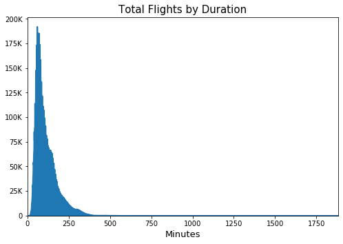


**Observation 5:** Our area graph above shows us flights average around 110 minutes while the median flight duration is 91 minutes. The longest flight duration was 1883 minutes which equates to over 31 hours! The conclusion is 98.1% of flights are under 300 minutes and the remaining 1.9% of flights are generally under 300 minutes or 5 hours. 

### 3.6. Flight Distance in Miles


```python
# Creating flight_distance
flight_distance = df8991['Distance']

# Creating a new dataframe
flight_distance = pd.DataFrame(flight_distance)

# Extracting the distance data
flight_distance['FlightDistance'] = df8991['Distance']

# Adding a new column to count flights by distance
flight_distance['Flights'] = flight_distance['FlightDistance'].count

# Drop column
flight_distance.drop(columns=['Distance'], axis=1, inplace=True)

# Grouping the data by distance
distance_data  = flight_distance.groupby('FlightDistance').count()
flights_by_distance = distance_data
flights_by_distance_idx = distance_data.reset_index()

# Looking at the dataframe we created
flights_by_distance.head()
```


<div>
<style scoped>
    .dataframe tbody tr th:only-of-type {
        vertical-align: middle;
    }

    .dataframe tbody tr th {
        vertical-align: top;
    }

    .dataframe thead th {
        text-align: right;
    }
</style>
<table border="1" class="dataframe">
  <thead>
    <tr style="text-align: right;">
      <th></th>
      <th>Flights</th>
    </tr>
    <tr>
      <th>FlightDistance</th>
      <th></th>
    </tr>
  </thead>
  <tbody>
    <tr>
      <th>0</th>
      <td>1</td>
    </tr>
    <tr>
      <th>11</th>
      <td>889</td>
    </tr>
    <tr>
      <th>17</th>
      <td>4</td>
    </tr>
    <tr>
      <th>18</th>
      <td>2</td>
    </tr>
    <tr>
      <th>21</th>
      <td>5696</td>
    </tr>
  </tbody>
</table>
</div>


```python
# Minimum and maxiumum distance travelled
df8991['Distance'].min(), df8991['Distance'].max()
```


    (0, 4502)


```python
# Average flight distance
df8991['Distance'].mean()
```


    632.9591811969572


```python
df8991['Distance'][df8991['Distance'] > 2800].count()/df8991['Distance'].count()
```


    0.0016491901344779533


```python
# Plot
plt.hist(data = flights_by_distance_idx, x = 'FlightDistance', bins = 25) #, y = 'Flights'

# Set title label
plt.title('Total Flights by Distance', fontsize = 15)

# Set axis labels
plt.ylabel('', fontsize = 13)
plt.xlabel('Distance (Miles)', fontsize = 13)

# Ticks fixed for histogram
ax = plt.gca()
ax.yaxis.set_major_formatter(tick.FuncFormatter(lambda x, pos: '{:,.0f}'.format(x/1) + 'K'))

# Show
plt.tight_layout(pad=1)
plt.savefig('images/charts/total_flights_by_distance.png')
plt.show()
```


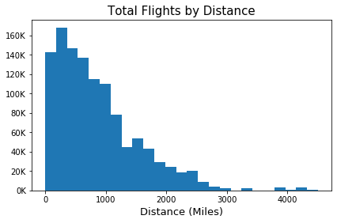


**Observation 6:** Most flights range from around 100 to 1000 miles and steadily decline after, with the average being 632 miles. 2500-3000 miles seems to be the point flights most drastically reduce. Statistically 0.1% of flights go over 2800 miles.

### 3.7. Flights by Carrier


```python
# Creating flight_carrier
flight_carrier = df8991['UniqueCarrier']

# Creating a new dataframe
flight_carrier = pd.DataFrame(flight_carrier)

# Extracting the carrier data
flight_carrier['FlightCarrier'] = df8991['UniqueCarrier']

# Adding a new column to count flights by carrier
flight_carrier['Flights'] = flight_carrier['FlightCarrier'].count

# Drop column
flight_carrier.drop(columns=['UniqueCarrier'], axis=1, inplace=True)

# Grouping the data by carrier
carrier_data  = flight_carrier.groupby('FlightCarrier').count()
flights_by_carrier = carrier_data

# Looking at the dataframe we created
flights_by_carrier.head()
```


<div>
<style scoped>
    .dataframe tbody tr th:only-of-type {
        vertical-align: middle;
    }

    .dataframe tbody tr th {
        vertical-align: top;
    }

    .dataframe thead th {
        text-align: right;
    }
</style>
<table border="1" class="dataframe">
  <thead>
    <tr style="text-align: right;">
      <th></th>
      <th>Flights</th>
    </tr>
    <tr>
      <th>FlightCarrier</th>
      <th></th>
    </tr>
  </thead>
  <tbody>
    <tr>
      <th>AA</th>
      <td>2084513</td>
    </tr>
    <tr>
      <th>AS</th>
      <td>267975</td>
    </tr>
    <tr>
      <th>CO</th>
      <td>1241287</td>
    </tr>
    <tr>
      <th>DL</th>
      <td>2430469</td>
    </tr>
    <tr>
      <th>EA</th>
      <td>398362</td>
    </tr>
  </tbody>
</table>
</div>


```python
# Creating a filtered database for top 10 carriers ascending
carriers_top_10 = flights_by_carrier.sort_values('Flights', ascending=False).iloc[0:10]

# Dataframe without index
carriers_top_10_idx = carriers_top_10.reset_index()
```


```python
# Top 10 Carriers
carriers_top_10
```


<div>
<style scoped>
    .dataframe tbody tr th:only-of-type {
        vertical-align: middle;
    }

    .dataframe tbody tr th {
        vertical-align: top;
    }

    .dataframe thead th {
        text-align: right;
    }
</style>
<table border="1" class="dataframe">
  <thead>
    <tr style="text-align: right;">
      <th></th>
      <th>Flights</th>
    </tr>
    <tr>
      <th>FlightCarrier</th>
      <th></th>
    </tr>
  </thead>
  <tbody>
    <tr>
      <th>US</th>
      <td>2575160</td>
    </tr>
    <tr>
      <th>DL</th>
      <td>2430469</td>
    </tr>
    <tr>
      <th>AA</th>
      <td>2084513</td>
    </tr>
    <tr>
      <th>UA</th>
      <td>1774850</td>
    </tr>
    <tr>
      <th>NW</th>
      <td>1352989</td>
    </tr>
    <tr>
      <th>CO</th>
      <td>1241287</td>
    </tr>
    <tr>
      <th>WN</th>
      <td>950837</td>
    </tr>
    <tr>
      <th>TW</th>
      <td>756992</td>
    </tr>
    <tr>
      <th>HP</th>
      <td>623477</td>
    </tr>
    <tr>
      <th>EA</th>
      <td>398362</td>
    </tr>
  </tbody>
</table>
</div>


```python
carriers.head()
```


<div>
<style scoped>
    .dataframe tbody tr th:only-of-type {
        vertical-align: middle;
    }

    .dataframe tbody tr th {
        vertical-align: top;
    }

    .dataframe thead th {
        text-align: right;
    }
</style>
<table border="1" class="dataframe">
  <thead>
    <tr style="text-align: right;">
      <th></th>
      <th>code</th>
      <th>description</th>
    </tr>
  </thead>
  <tbody>
    <tr>
      <th>0</th>
      <td>02Q</td>
      <td>Titan Airways</td>
    </tr>
    <tr>
      <th>1</th>
      <td>04Q</td>
      <td>Tradewind Aviation</td>
    </tr>
    <tr>
      <th>2</th>
      <td>05Q</td>
      <td>Comlux Aviation, AG</td>
    </tr>
    <tr>
      <th>3</th>
      <td>06Q</td>
      <td>Master Top Linhas Aereas Ltd.</td>
    </tr>
    <tr>
      <th>4</th>
      <td>07Q</td>
      <td>Flair Airlines Ltd.</td>
    </tr>
  </tbody>
</table>
</div>


```python
# Filter
carriers[carriers['code'] == 'US']
```


<div>
<style scoped>
    .dataframe tbody tr th:only-of-type {
        vertical-align: middle;
    }

    .dataframe tbody tr th {
        vertical-align: top;
    }

    .dataframe thead th {
        text-align: right;
    }
</style>
<table border="1" class="dataframe">
  <thead>
    <tr style="text-align: right;">
      <th></th>
      <th>code</th>
      <th>description</th>
    </tr>
  </thead>
  <tbody>
    <tr>
      <th>1308</th>
      <td>US</td>
      <td>US Airways Inc. (Merged with America West 9/05...</td>
    </tr>
  </tbody>
</table>
</div>


```python
# Renaming column to prepare for df merge
carriers_top_10_idx.rename(columns={"FlightCarrier":"code"}, inplace=True)
```


```python
# Merging dataframes to get the carrier description
carriers_top_10_idx2 = pd.merge(left=carriers_top_10_idx, right=carriers, how='left', on='code')
```


```python
carriers_top_10_idx2
```


<div>
<style scoped>
    .dataframe tbody tr th:only-of-type {
        vertical-align: middle;
    }

    .dataframe tbody tr th {
        vertical-align: top;
    }

    .dataframe thead th {
        text-align: right;
    }
</style>
<table border="1" class="dataframe">
  <thead>
    <tr style="text-align: right;">
      <th></th>
      <th>code</th>
      <th>Flights</th>
      <th>description</th>
    </tr>
  </thead>
  <tbody>
    <tr>
      <th>0</th>
      <td>US</td>
      <td>2575160</td>
      <td>US Airways Inc. (Merged with America West 9/05...</td>
    </tr>
    <tr>
      <th>1</th>
      <td>DL</td>
      <td>2430469</td>
      <td>Delta Air Lines Inc.</td>
    </tr>
    <tr>
      <th>2</th>
      <td>AA</td>
      <td>2084513</td>
      <td>American Airlines Inc.</td>
    </tr>
    <tr>
      <th>3</th>
      <td>UA</td>
      <td>1774850</td>
      <td>United Air Lines Inc.</td>
    </tr>
    <tr>
      <th>4</th>
      <td>NW</td>
      <td>1352989</td>
      <td>Northwest Airlines Inc.</td>
    </tr>
    <tr>
      <th>5</th>
      <td>CO</td>
      <td>1241287</td>
      <td>Continental Air Lines Inc.</td>
    </tr>
    <tr>
      <th>6</th>
      <td>WN</td>
      <td>950837</td>
      <td>Southwest Airlines Co.</td>
    </tr>
    <tr>
      <th>7</th>
      <td>TW</td>
      <td>756992</td>
      <td>Trans World Airways LLC</td>
    </tr>
    <tr>
      <th>8</th>
      <td>HP</td>
      <td>623477</td>
      <td>America West Airlines Inc. (Merged with US Air...</td>
    </tr>
    <tr>
      <th>9</th>
      <td>EA</td>
      <td>398362</td>
      <td>Eastern Air Lines Inc.</td>
    </tr>
  </tbody>
</table>
</div>


```python
carriers_top_10_idx2['description'] = carriers_top_10_idx2['description'].str.replace(r"\(.*\)","")
```


```python
carriers_top_10_idx2
```


<div>
<style scoped>
    .dataframe tbody tr th:only-of-type {
        vertical-align: middle;
    }

    .dataframe tbody tr th {
        vertical-align: top;
    }

    .dataframe thead th {
        text-align: right;
    }
</style>
<table border="1" class="dataframe">
  <thead>
    <tr style="text-align: right;">
      <th></th>
      <th>code</th>
      <th>Flights</th>
      <th>description</th>
    </tr>
  </thead>
  <tbody>
    <tr>
      <th>0</th>
      <td>US</td>
      <td>2575160</td>
      <td>US Airways Inc.</td>
    </tr>
    <tr>
      <th>1</th>
      <td>DL</td>
      <td>2430469</td>
      <td>Delta Air Lines Inc.</td>
    </tr>
    <tr>
      <th>2</th>
      <td>AA</td>
      <td>2084513</td>
      <td>American Airlines Inc.</td>
    </tr>
    <tr>
      <th>3</th>
      <td>UA</td>
      <td>1774850</td>
      <td>United Air Lines Inc.</td>
    </tr>
    <tr>
      <th>4</th>
      <td>NW</td>
      <td>1352989</td>
      <td>Northwest Airlines Inc.</td>
    </tr>
    <tr>
      <th>5</th>
      <td>CO</td>
      <td>1241287</td>
      <td>Continental Air Lines Inc.</td>
    </tr>
    <tr>
      <th>6</th>
      <td>WN</td>
      <td>950837</td>
      <td>Southwest Airlines Co.</td>
    </tr>
    <tr>
      <th>7</th>
      <td>TW</td>
      <td>756992</td>
      <td>Trans World Airways LLC</td>
    </tr>
    <tr>
      <th>8</th>
      <td>HP</td>
      <td>623477</td>
      <td>America West Airlines Inc.</td>
    </tr>
    <tr>
      <th>9</th>
      <td>EA</td>
      <td>398362</td>
      <td>Eastern Air Lines Inc.</td>
    </tr>
  </tbody>
</table>
</div>


```python
carriers_top_10_idx2['Flights'].pct_change()
```


    0         NaN
    1   -0.056187
    2   -0.142341
    3   -0.148554
    4   -0.237688
    5   -0.082559
    6   -0.233991
    7   -0.203868
    8   -0.176376
    9   -0.361064
    Name: Flights, dtype: float64


```python
# Variables
labels = [' ',' ',' ',' ',' ',' ',' ',' ',' ',' ']
explode = [0.1, 0.01, 0.01, 0.01, 0.01, 0.01, 0.01, 0.01, 0.01, 0.01]

# Plot
carriers_top_10.plot(kind='pie', figsize=(7, 5), rot=0, subplots=True, labels=labels, legend=True, 
                     cmap='jet', autopct='%1.1f%%', pctdistance=1.15, explode=explode)

# Legend
carrier_list = list(carriers_top_10_idx2['description'])
plt.legend(labels = carrier_list, bbox_to_anchor=(1.55, 1), loc=1, borderaxespad=0.0)

# Set title label
plt.title('Total Flights by Carrier', loc='center', fontsize = 15)

# Set axis labels
plt.ylabel('', fontsize = 13)
plt.xlabel('', fontsize = 13)

# Ticks
ax = plt.gca()
ax.yaxis.set_major_formatter(tick.FuncFormatter(reformat_large_tick_values));

# Show
plt.tight_layout(pad=1)
plt.savefig('images/charts/total_flights_by_carrier.png')
plt.show()
```


**Observation 7:** The most popular carrier is US Airways Inc with 2,575,160 flights between 1989-1991, that represents an 18.1% share of all flights from our data. Delta Air Lines Inc. is a close 2nd place with 2,430,469 or a 5.6% difference from 1st place with a 17% share of the market. Those two airlines would have gone toe to toe dominating aviation at that time. However, American Airlines Inc. features in 3rd place with 2,084,513 flights with a strong 14.7% market share. The gap widens to a 14% difference in total flights vs 1st place. This trend continues as the other airlines share smaller and smaller stakes in the market.

### 3.8. Flight Distance by Day


```python
# Grouping data by day of week then sorting index
weekday_cat = ['Monday', 'Tuesday', 'Wednesday', 'Thursday', 'Friday', 'Saturday', 'Sunday']
weekday = df8991.drop(['FlightNum'], axis=1).groupby(['DayOfWeek']).mean().reindex(weekday_cat)

# Rename index variable
idx = {"Monday": "Mon", "Tuesday":"Tue", "Wednesday":"Wed", "Thursday":"Thu", "Friday":"Fri", "Saturday":"Sat", "Sunday":"Sun"}
```


```python
weekday.head(7)
```


<div>
<style scoped>
    .dataframe tbody tr th:only-of-type {
        vertical-align: middle;
    }

    .dataframe tbody tr th {
        vertical-align: top;
    }

    .dataframe thead th {
        text-align: right;
    }
</style>
<table border="1" class="dataframe">
  <thead>
    <tr style="text-align: right;">
      <th></th>
      <th>ActualElapsedTime</th>
      <th>CRSElapsedTime</th>
      <th>ArrDelay</th>
      <th>DepDelay</th>
      <th>Distance</th>
      <th>Cancelled</th>
      <th>Diverted</th>
    </tr>
    <tr>
      <th>DayOfWeek</th>
      <th></th>
      <th></th>
      <th></th>
      <th></th>
      <th></th>
      <th></th>
      <th></th>
    </tr>
  </thead>
  <tbody>
    <tr>
      <th>Monday</th>
      <td>109.058930</td>
      <td>109.488231</td>
      <td>4.964975</td>
      <td>5.425532</td>
      <td>628.187534</td>
      <td>0.0</td>
      <td>0.0</td>
    </tr>
    <tr>
      <th>Tuesday</th>
      <td>109.530635</td>
      <td>109.422163</td>
      <td>6.213578</td>
      <td>6.144185</td>
      <td>627.741170</td>
      <td>0.0</td>
      <td>0.0</td>
    </tr>
    <tr>
      <th>Wednesday</th>
      <td>109.712301</td>
      <td>109.355599</td>
      <td>7.021518</td>
      <td>6.684452</td>
      <td>627.115591</td>
      <td>0.0</td>
      <td>0.0</td>
    </tr>
    <tr>
      <th>Thursday</th>
      <td>110.101038</td>
      <td>109.411749</td>
      <td>8.744248</td>
      <td>8.079987</td>
      <td>627.562929</td>
      <td>0.0</td>
      <td>0.0</td>
    </tr>
    <tr>
      <th>Friday</th>
      <td>110.096784</td>
      <td>109.529341</td>
      <td>9.349141</td>
      <td>8.810754</td>
      <td>628.533479</td>
      <td>0.0</td>
      <td>0.0</td>
    </tr>
    <tr>
      <th>Saturday</th>
      <td>110.790458</td>
      <td>112.260839</td>
      <td>4.769930</td>
      <td>6.301211</td>
      <td>650.885998</td>
      <td>0.0</td>
      <td>0.0</td>
    </tr>
    <tr>
      <th>Sunday</th>
      <td>110.143351</td>
      <td>111.337036</td>
      <td>5.055255</td>
      <td>6.310329</td>
      <td>643.155490</td>
      <td>0.0</td>
      <td>0.0</td>
    </tr>
  </tbody>
</table>
</div>


```python
weekday['Distance']
```


    DayOfWeek
    Monday       628.187534
    Tuesday      627.741170
    Wednesday    627.115591
    Thursday     627.562929
    Friday       628.533479
    Saturday     650.885998
    Sunday       643.155490
    Name: Distance, dtype: float64


```python
# Figsize
plt.figure(figsize = [15, 6])
plt.suptitle('Elapsed Time and Distance vs Day', fontsize=15)

# Plot 1
plt.subplot(1, 2, 1)
weekday['ActualElapsedTime'].rename(index = idx, inplace = False).plot(kind = 'line', title='Actual Elapsed Time', legend=None)
plt.xlabel('')
plt.ylabel('')

# Plot 2
plt.subplot(1, 2, 1)
weekday['CRSElapsedTime'].rename(index = idx, inplace = False).plot(kind = 'line', title='Actual Elapsed Time vs CRS Elapsed Time (Min)', legend=None)
plt.legend()
plt.xlabel('')
plt.ylabel('')

# Plot 3
plt.subplot(1, 2, 2)
weekday['Distance'].rename(index = idx, inplace = False).plot(kind = 'line', title='Distance (Miles)', legend=None)
plt.xlabel('')
plt.ylabel('')

# Show
fig = ax.get_figure()
fig.tight_layout()
fig.subplots_adjust(top=2)
plt.savefig('images/charts/time_vs_distance_vs_day.png')
plt.show()
```

    C:\Users\Ags91\AppData\Roaming\Python\Python37\site-packages\ipykernel_launcher.py:12: MatplotlibDeprecationWarning: Adding an axes using the same arguments as a previous axes currently reuses the earlier instance.  In a future version, a new instance will always be created and returned.  Meanwhile, this warning can be suppressed, and the future behavior ensured, by passing a unique label to each axes instance.
      if sys.path[0] == '':
    


**Observation 8:** Flight time seems to increase as the week passes. The weekend has the longest flights on average, indicating passengers might be travelling on weekend holidays but commute on weekdays. We also know from other data that fewer flights take place during the weekend but also delays are lower while flight duration and distance is longer on average.

### 3.9. Delay by Origin and Destination


```python
df8991['Origin'].unique()
```


    array(['SFO', 'DEN', 'HNL', 'LIH', 'PHL', 'OGG', 'IAD', 'EWR', 'LAX',
           'KOA', 'ORD', 'MKE', 'IAH', 'MSY', 'RIC', 'SEA', 'FLL', 'MCO',
           'BWI', 'HOU', 'MCI', 'SJC', 'CMH', 'OMA', 'ORF', 'BOS', 'ABQ',
           'SMF', 'OKC', 'SGF', 'SLC', 'ONT', 'SAN', 'BUF', 'LGB', 'MIA',
           'BDL', 'IND', 'TPA', 'SYR', 'PIT', 'STL', 'PDX', 'CLT', 'PHX',
           'CVG', 'MBS', 'ATL', 'DSM', 'LAS', 'AUS', 'JAN', 'MEM', 'DTW',
           'SRQ', 'MSP', 'DFW', 'PSP', 'MDT', 'FAT', 'BGR', 'PWM', 'ROC',
           'MDW', 'FAR', 'CHS', 'SAV', 'LGA', 'ANC', 'FSD', 'OAK', 'CLE',
           'CAE', 'TUL', 'HPN', 'GSO', 'RDU', 'DAY', 'GRR', 'MSN', 'JAX',
           'BNA', 'COS', 'SAT', 'CID', 'PBI', 'GEG', 'LNK', 'PVD', 'BIL',
           'SBA', 'ELP', 'SDF', 'TUS', 'SNA', 'ICT', 'BUR', 'ABE', 'RAP',
           'GTF', 'LIT', 'ALB', 'RNO', 'BHM', 'HSV', 'BOI', 'DCA', 'SUX',
           'TYS', 'MHT', 'EUG', 'MLI', 'BTV', 'PIA', 'FAI', 'MFR', 'MRY',
           'JFK', 'RSW', 'ERI', 'PHF', 'PSC', 'ISP', 'AVP', 'EVV', 'ELM',
           'LEX', 'ORH', 'BGM', 'TRI', 'CRW', 'TOL', 'MYR', 'ITH', 'GSP',
           'HTS', 'ACY', 'BLI', 'SCK', 'RDM', 'CCR', 'YKM', 'DAL', 'LBB',
           'CRP', 'AMA', 'HRL', 'MAF', 'DET', 'VPS', 'AZO', 'FWA', 'DLH',
           'ATW', 'GRB', 'BIS', 'GPT', 'LAN', 'GFK', 'RST', 'BZN', 'EAU',
           'LSE', 'MOT', 'MOB', 'MSO', 'BTR', 'CHA', 'SHV', 'MGM', 'PFN',
           'HDN', 'SBN', 'STT', 'STX', 'FAY', 'AVL', 'CAK', 'OAJ', 'TLH',
           'ROA', 'ILM', 'AGS', 'DAB', 'FNT', 'ISO', 'CHO', 'CMI', 'LYH',
           'UCA', 'PNS', 'EYW', 'APF', 'GNV', 'SJU', 'PUB', 'MLU', 'MLB',
           'CSG', 'CPR', 'IDA', 'JAC', 'HLN', 'FCA', 'JNU', 'BTM', 'DRO',
           'GJT', 'YUM', 'FLG', 'GCN', 'PIE', 'TVL', 'BFL', 'GUC', 'BET',
           'OME', 'OTZ', 'SCC', 'CDV', 'YAK', 'PSG', 'SIT', 'WRG', 'GUM',
           'MFE', 'LFT', 'YAP', 'ROR', 'SPN', 'ROP', 'TVC', 'GST', 'EGE',
           'SUN', 'PMD', 'SWF', 'EFD', 'PSE', 'HVN', 'TTN', 'BQN', 'SPI'],
          dtype=object)


```python
origin = df8991.drop(['FlightNum'], axis=1).groupby(['Origin']).mean()
```


```python
dest = df8991.drop(['FlightNum'], axis=1).groupby(['Dest']).mean()
```


```python
origin['DepDelay'].sort_values(ascending=False).iloc[0:10]
```


    Origin
    PSE    22.716667
    YAP    19.763158
    SUN    14.538462
    HDN    12.525217
    JFK    11.455878
    ORD    10.036105
    GUC     9.815362
    JNU     9.490426
    EWR     8.866009
    PIT     8.842862
    Name: DepDelay, dtype: float64


```python
# Assigning high and low airport delay
aplow_delay = (origin['DepDelay'].sort_values(ascending=False)+dest['ArrDelay']).sort_values(ascending=True).iloc[0:10].sort_values(ascending=False)
aphigh_delay = (origin['DepDelay'].sort_values(ascending=False)+dest['ArrDelay']).sort_values(ascending=False).iloc[0:10].sort_values(ascending=True)
```


```python
# Top 10 lowest delay airports
aplow_delay.sort_values(ascending=True)
```


    BQN   -10.351648
    ATW    -5.999804
    YKM     0.053702
    MOT     0.203609
    EAU     0.944523
    PMD     1.263444
    ROP     1.655739
    LFT     2.202046
    PUB     2.252053
    GRB     2.559022
    dtype: float64


```python
# Top 10 highest delay airports
aphigh_delay.sort_values(ascending=False)
```


    PSE    53.250000
    SUN    38.038462
    YAP    37.362168
    HDN    22.337867
    GST    20.760290
    SIT    20.030887
    GUC    19.211647
    JFK    18.920419
    JNU    18.902215
    SFO    18.836069
    dtype: float64


```python
# Plot
#fig, (ax1, ax2) = plt.subplots(1,2, figsize=(15,6), gridspec_kw={'width_ratios':[1,1]})
#plt.suptitle('Delay by Destination vs Arrival')

# Chart 1
plt.subplot(1, 2, 1)
origin['DepDelay'].sort_values(ascending=False).iloc[0:10].plot(
    kind = 'Barh', figsize=(10, 5), legend=None, title='Departure Airports by Delay')

# Chart 2
plt.subplot(1, 2, 2)
dest['ArrDelay'].sort_values(ascending=False).iloc[0:10].plot(
    kind = 'Barh', figsize=(10, 5), legend=None, title='Arrival Airports by Delay', label='Delay in minutes')

# Show
plt.tight_layout(pad=1)
plt.savefig('images/charts/delay_by_origin_dest.png')
plt.show()
```


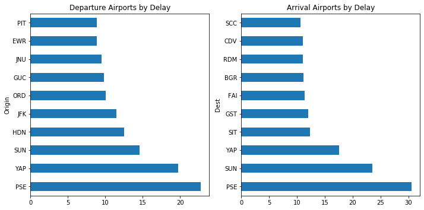


```python
# Plot
# Chart 1
plt.subplot(1, 2, 1)
aphigh_delay.plot(
    kind = 'Barh', figsize=(10, 5), legend=None, title='Top 10 Airports by Highest Total Delay')

# Chart 2
plt.subplot(1, 2, 2)
aplow_delay.plot(
    kind = 'Barh', figsize=(10, 5), legend=None, title='Top 10 Airports by Lowest Total Delay')

# Show
plt.tight_layout(pad=1)
plt.savefig('images/charts/delay_by_airport.png')
plt.show()
```


```python
# Airline carrier filter
carriers[carriers['code'] == 'UA']
```


<div>
<style scoped>
    .dataframe tbody tr th:only-of-type {
        vertical-align: middle;
    }

    .dataframe tbody tr th {
        vertical-align: top;
    }

    .dataframe thead th {
        text-align: right;
    }
</style>
<table border="1" class="dataframe">
  <thead>
    <tr style="text-align: right;">
      <th></th>
      <th>code</th>
      <th>description</th>
    </tr>
  </thead>
  <tbody>
    <tr>
      <th>1297</th>
      <td>UA</td>
      <td>United Air Lines Inc.</td>
    </tr>
  </tbody>
</table>
</div>


```python
# Airport name filter
airports[airports['iata'] == 'PSE']
```


<div>
<style scoped>
    .dataframe tbody tr th:only-of-type {
        vertical-align: middle;
    }

    .dataframe tbody tr th {
        vertical-align: top;
    }

    .dataframe thead th {
        text-align: right;
    }
</style>
<table border="1" class="dataframe">
  <thead>
    <tr style="text-align: right;">
      <th></th>
      <th>iata</th>
      <th>airport</th>
      <th>city</th>
      <th>state</th>
      <th>country</th>
      <th>lat</th>
      <th>long</th>
    </tr>
  </thead>
  <tbody>
    <tr>
      <th>2674</th>
      <td>PSE</td>
      <td>Mercedita</td>
      <td>Ponce</td>
      <td>PR</td>
      <td>USA</td>
      <td>18.008303</td>
      <td>-66.563012</td>
    </tr>
  </tbody>
</table>
</div>


```python
# Airports by flights
(df8991['Origin'] == 'ATW').sum()+(df8991['Dest'] == 'ATW').sum()
```


    1861


**Observation 9:** PSE - Mercedita Airport has the highest average delays at 53.2 minutes. BQN - Rafael Hernández Airport has the lowest average delays at -10.35 minutes. In other words, early.

<a id='bivariate'></a>
## Step 4: Bivariate Exploration 📈

### 4.1. Airports by Traffic


```python
df8991['Dest'].unique()
```


    array(['HNL', 'IAD', 'SFO', 'DEN', 'LIH', 'LAX', 'PDX', 'ORD', 'KOA',
           'OGG', 'BOS', 'EWR', 'IAH', 'MSY', 'PHX', 'OMA', 'ABE', 'SDF',
           'DFW', 'PHL', 'BTV', 'FAT', 'DTW', 'ABQ', 'TUL', 'AUS', 'MSP',
           'PIT', 'GSO', 'SMF', 'TUS', 'IND', 'GRR', 'HOU', 'ORF', 'SJC',
           'SAN', 'CMH', 'SEA', 'MCI', 'MEM', 'BDL', 'TPA', 'PBI', 'FSD',
           'BWI', 'DSM', 'CVG', 'MCO', 'MHT', 'PWM', 'BGR', 'BOI', 'RDU',
           'LAS', 'DAY', 'SAV', 'CHS', 'FAI', 'ANC', 'CLE', 'OAK', 'ICT',
           'OKC', 'MKE', 'GEG', 'LIT', 'TYS', 'BNA', 'BUF', 'COS', 'FAR',
           'SGF', 'LNK', 'SUX', 'RAP', 'GTF', 'BIL', 'CLT', 'ONT', 'SLC',
           'ATL', 'STL', 'MIA', 'MSN', 'MRY', 'JAX', 'MBS', 'CAE', 'RNO',
           'HPN', 'ROC', 'ALB', 'RSW', 'RIC', 'SBA', 'SAT', 'LGB', 'PVD',
           'HSV', 'MDT', 'JAN', 'DCA', 'BUR', 'JFK', 'SNA', 'PSP', 'SYR',
           'FLL', 'BHM', 'MLI', 'PIA', 'CID', 'SRQ', 'LGA', 'MDW', 'ELP',
           'EUG', 'MFR', 'ERI', 'AVP', 'ISP', 'PSC', 'EVV', 'MYR', 'GSP',
           'PHF', 'ITH', 'CRW', 'BGM', 'TOL', 'LEX', 'ELM', 'ORH', 'HTS',
           'TRI', 'ACY', 'SCK', 'CCR', 'YKM', 'RDM', 'BLI', 'HRL', 'DAL',
           'AMA', 'LBB', 'CRP', 'MAF', 'DET', 'GRB', 'FWA', 'RST', 'DLH',
           'AZO', 'GFK', 'LAN', 'LSE', 'EAU', 'BZN', 'MOT', 'BIS', 'MOB',
           'GPT', 'MSO', 'CHA', 'ATW', 'SHV', 'VPS', 'MGM', 'BTR', 'PFN',
           'HDN', 'SBN', 'STT', 'STX', 'CAK', 'FNT', 'AVL', 'OAJ', 'FAY',
           'ROA', 'ISO', 'DAB', 'ILM', 'AGS', 'CMI', 'TLH', 'CHO', 'LYH',
           'UCA', 'PNS', 'EYW', 'GNV', 'APF', 'SJU', 'PUB', 'MLB', 'MLU',
           'CSG', 'CPR', 'JAC', 'FCA', 'HLN', 'IDA', 'JNU', 'BTM', 'GJT',
           'YUM', 'DRO', 'FLG', 'GCN', 'BFL', 'GUC', 'PIE', 'TVL', 'BET',
           'OME', 'OTZ', 'SCC', 'YAK', 'CDV', 'SIT', 'PSG', 'WRG', 'GUM',
           'MFE', 'LFT', 'YAP', 'ROR', 'SPN', 'ROP', 'TVC', 'GST', 'EGE',
           'SUN', 'PMD', 'SWF', 'EFD', 'PSE', 'HVN', 'TTN', 'BQN', 'SPI'],
          dtype=object)


```python
# Extracting the month number from the dates
flight_dest = df8991['Date'].dt.month

# Assigning the months
months = ['Jan','Feb','Mar','Apr','May','Jun','Jul','Aug','Sep','Oct','Nov','Dec']

# Creating a new dataframe
flight_dest = pd.DataFrame(flight_dest)

# Renaming the column name of the new dataframe
flight_dest.rename(columns = {'Date':'Month'},inplace=True)

# Adding a new column to count flights per month
flight_dest['Flights'] = df8991['Date'].dt.month.count

# Adding a new column to sum destinations per month
flight_dest['Dest'] = df8991['Dest']

# Grouping the data by month then assigning month names to 'month' column
month_dest  = flight_dest.groupby([('Month'),('Dest')]).count()

# Renaming each month number to a real month name
flights_by_dest = month_dest.rename(index={1: 'Jan', 2: 'Feb', 3: 'Mar', 4: 'Apr', 5: 'May', 6: 'Jun', 7: 'Jul', 8: 'Aug', 9: 'Sep', 10: 'Oct', 11: 'Nov', 12: 'Dec'})

# Looking at the dataframe we created
flights_by_dest.head()
```


<div>
<style scoped>
    .dataframe tbody tr th:only-of-type {
        vertical-align: middle;
    }

    .dataframe tbody tr th {
        vertical-align: top;
    }

    .dataframe thead th {
        text-align: right;
    }
</style>
<table border="1" class="dataframe">
  <thead>
    <tr style="text-align: right;">
      <th></th>
      <th></th>
      <th>Flights</th>
    </tr>
    <tr>
      <th>Month</th>
      <th>Dest</th>
      <th></th>
    </tr>
  </thead>
  <tbody>
    <tr>
      <th rowspan="5" valign="top">Jan</th>
      <th>ABE</th>
      <td>1281</td>
    </tr>
    <tr>
      <th>ABQ</th>
      <td>7264</td>
    </tr>
    <tr>
      <th>ACY</th>
      <td>160</td>
    </tr>
    <tr>
      <th>AGS</th>
      <td>780</td>
    </tr>
    <tr>
      <th>ALB</th>
      <td>3203</td>
    </tr>
  </tbody>
</table>
</div>


```python
flights_by_dest_piv = flights_by_dest.reset_index().pivot(columns='Month',index='Dest',values='Flights')
flights_by_dest_piv = flights_by_dest_piv.reindex(columns= ['Jan','Feb','Mar','Apr','May','Jun','Jul','Aug','Sep','Oct','Nov','Dec'])
```


```python
flights_by_dest_piv.head()
```


<div>
<style scoped>
    .dataframe tbody tr th:only-of-type {
        vertical-align: middle;
    }

    .dataframe tbody tr th {
        vertical-align: top;
    }

    .dataframe thead th {
        text-align: right;
    }
</style>
<table border="1" class="dataframe">
  <thead>
    <tr style="text-align: right;">
      <th>Month</th>
      <th>Jan</th>
      <th>Feb</th>
      <th>Mar</th>
      <th>Apr</th>
      <th>May</th>
      <th>Jun</th>
      <th>Jul</th>
      <th>Aug</th>
      <th>Sep</th>
      <th>Oct</th>
      <th>Nov</th>
      <th>Dec</th>
    </tr>
    <tr>
      <th>Dest</th>
      <th></th>
      <th></th>
      <th></th>
      <th></th>
      <th></th>
      <th></th>
      <th></th>
      <th></th>
      <th></th>
      <th></th>
      <th></th>
      <th></th>
    </tr>
  </thead>
  <tbody>
    <tr>
      <th>ABE</th>
      <td>1281.0</td>
      <td>1155.0</td>
      <td>1169.0</td>
      <td>1151.0</td>
      <td>1276.0</td>
      <td>1319.0</td>
      <td>1499.0</td>
      <td>1508.0</td>
      <td>1490.0</td>
      <td>1599.0</td>
      <td>1540.0</td>
      <td>1519.0</td>
    </tr>
    <tr>
      <th>ABQ</th>
      <td>7264.0</td>
      <td>6549.0</td>
      <td>7691.0</td>
      <td>7645.0</td>
      <td>7947.0</td>
      <td>7708.0</td>
      <td>7900.0</td>
      <td>7909.0</td>
      <td>7580.0</td>
      <td>7826.0</td>
      <td>7281.0</td>
      <td>7311.0</td>
    </tr>
    <tr>
      <th>ACY</th>
      <td>160.0</td>
      <td>144.0</td>
      <td>163.0</td>
      <td>162.0</td>
      <td>209.0</td>
      <td>211.0</td>
      <td>249.0</td>
      <td>242.0</td>
      <td>188.0</td>
      <td>190.0</td>
      <td>182.0</td>
      <td>184.0</td>
    </tr>
    <tr>
      <th>AGS</th>
      <td>780.0</td>
      <td>703.0</td>
      <td>782.0</td>
      <td>747.0</td>
      <td>796.0</td>
      <td>789.0</td>
      <td>796.0</td>
      <td>809.0</td>
      <td>784.0</td>
      <td>810.0</td>
      <td>789.0</td>
      <td>823.0</td>
    </tr>
    <tr>
      <th>ALB</th>
      <td>3203.0</td>
      <td>2989.0</td>
      <td>3260.0</td>
      <td>3215.0</td>
      <td>3256.0</td>
      <td>3160.0</td>
      <td>3238.0</td>
      <td>3312.0</td>
      <td>3193.0</td>
      <td>3356.0</td>
      <td>3097.0</td>
      <td>3165.0</td>
    </tr>
  </tbody>
</table>
</div>


```python
flights_by_dest_piv.columns
```


    Index(['Jan', 'Feb', 'Mar', 'Apr', 'May', 'Jun', 'Jul', 'Aug', 'Sep', 'Oct',
           'Nov', 'Dec'],
          dtype='object', name='Month')


```python
flights_by_dest_piv.sort_values(by=['Dest'], axis=0, ascending=False).head()
```


<div>
<style scoped>
    .dataframe tbody tr th:only-of-type {
        vertical-align: middle;
    }

    .dataframe tbody tr th {
        vertical-align: top;
    }

    .dataframe thead th {
        text-align: right;
    }
</style>
<table border="1" class="dataframe">
  <thead>
    <tr style="text-align: right;">
      <th>Month</th>
      <th>Jan</th>
      <th>Feb</th>
      <th>Mar</th>
      <th>Apr</th>
      <th>May</th>
      <th>Jun</th>
      <th>Jul</th>
      <th>Aug</th>
      <th>Sep</th>
      <th>Oct</th>
      <th>Nov</th>
      <th>Dec</th>
    </tr>
    <tr>
      <th>Dest</th>
      <th></th>
      <th></th>
      <th></th>
      <th></th>
      <th></th>
      <th></th>
      <th></th>
      <th></th>
      <th></th>
      <th></th>
      <th></th>
      <th></th>
    </tr>
  </thead>
  <tbody>
    <tr>
      <th>YUM</th>
      <td>463.0</td>
      <td>412.0</td>
      <td>451.0</td>
      <td>435.0</td>
      <td>411.0</td>
      <td>372.0</td>
      <td>374.0</td>
      <td>404.0</td>
      <td>364.0</td>
      <td>391.0</td>
      <td>373.0</td>
      <td>430.0</td>
    </tr>
    <tr>
      <th>YKM</th>
      <td>60.0</td>
      <td>51.0</td>
      <td>55.0</td>
      <td>59.0</td>
      <td>1.0</td>
      <td>NaN</td>
      <td>NaN</td>
      <td>NaN</td>
      <td>NaN</td>
      <td>NaN</td>
      <td>NaN</td>
      <td>NaN</td>
    </tr>
    <tr>
      <th>YAP</th>
      <td>42.0</td>
      <td>38.0</td>
      <td>47.0</td>
      <td>52.0</td>
      <td>54.0</td>
      <td>24.0</td>
      <td>20.0</td>
      <td>27.0</td>
      <td>26.0</td>
      <td>23.0</td>
      <td>24.0</td>
      <td>27.0</td>
    </tr>
    <tr>
      <th>YAK</th>
      <td>160.0</td>
      <td>121.0</td>
      <td>166.0</td>
      <td>171.0</td>
      <td>168.0</td>
      <td>164.0</td>
      <td>173.0</td>
      <td>174.0</td>
      <td>152.0</td>
      <td>166.0</td>
      <td>151.0</td>
      <td>144.0</td>
    </tr>
    <tr>
      <th>WRG</th>
      <td>63.0</td>
      <td>64.0</td>
      <td>77.0</td>
      <td>83.0</td>
      <td>87.0</td>
      <td>86.0</td>
      <td>81.0</td>
      <td>84.0</td>
      <td>78.0</td>
      <td>85.0</td>
      <td>59.0</td>
      <td>62.0</td>
    </tr>
  </tbody>
</table>
</div>


```python
# Filling NaN with 0
flights_by_dest_piv = flights_by_dest_piv.fillna(0)

# Changing from float to np.int64 to remove .0
flights_by_dest_piv = flights_by_dest_piv.astype(np.int64)

# Summing across the rows using .sum and 'axis=0'
flights_by_dest_piv['Total'] = flights_by_dest_piv.sum(axis=1).astype(np.int64)
```


```python
top_10_dest = flights_by_dest_piv.sort_values(by='Total', ascending=False).iloc[0:10,0:12]
top_10_dest
```


<div>
<style scoped>
    .dataframe tbody tr th:only-of-type {
        vertical-align: middle;
    }

    .dataframe tbody tr th {
        vertical-align: top;
    }

    .dataframe thead th {
        text-align: right;
    }
</style>
<table border="1" class="dataframe">
  <thead>
    <tr style="text-align: right;">
      <th>Month</th>
      <th>Jan</th>
      <th>Feb</th>
      <th>Mar</th>
      <th>Apr</th>
      <th>May</th>
      <th>Jun</th>
      <th>Jul</th>
      <th>Aug</th>
      <th>Sep</th>
      <th>Oct</th>
      <th>Nov</th>
      <th>Dec</th>
    </tr>
    <tr>
      <th>Dest</th>
      <th></th>
      <th></th>
      <th></th>
      <th></th>
      <th></th>
      <th></th>
      <th></th>
      <th></th>
      <th></th>
      <th></th>
      <th></th>
      <th></th>
    </tr>
  </thead>
  <tbody>
    <tr>
      <th>ORD</th>
      <td>64860</td>
      <td>58108</td>
      <td>66654</td>
      <td>66439</td>
      <td>68519</td>
      <td>66286</td>
      <td>67693</td>
      <td>68390</td>
      <td>65764</td>
      <td>67931</td>
      <td>63949</td>
      <td>66085</td>
    </tr>
    <tr>
      <th>DFW</th>
      <td>38769</td>
      <td>34937</td>
      <td>58998</td>
      <td>58056</td>
      <td>59562</td>
      <td>59201</td>
      <td>61925</td>
      <td>62389</td>
      <td>60610</td>
      <td>61807</td>
      <td>59015</td>
      <td>61795</td>
    </tr>
    <tr>
      <th>ATL</th>
      <td>57380</td>
      <td>51969</td>
      <td>51962</td>
      <td>50441</td>
      <td>52188</td>
      <td>52102</td>
      <td>55742</td>
      <td>58388</td>
      <td>58889</td>
      <td>62291</td>
      <td>59045</td>
      <td>60404</td>
    </tr>
    <tr>
      <th>LAX</th>
      <td>39072</td>
      <td>34862</td>
      <td>39950</td>
      <td>39503</td>
      <td>41515</td>
      <td>41261</td>
      <td>42912</td>
      <td>42905</td>
      <td>39996</td>
      <td>41003</td>
      <td>39004</td>
      <td>39192</td>
    </tr>
    <tr>
      <th>DEN</th>
      <td>33867</td>
      <td>30862</td>
      <td>35191</td>
      <td>34093</td>
      <td>34796</td>
      <td>34488</td>
      <td>35836</td>
      <td>36688</td>
      <td>33778</td>
      <td>34459</td>
      <td>32398</td>
      <td>34396</td>
    </tr>
    <tr>
      <th>PHX</th>
      <td>32979</td>
      <td>29793</td>
      <td>34678</td>
      <td>33877</td>
      <td>34737</td>
      <td>33711</td>
      <td>34804</td>
      <td>34720</td>
      <td>32948</td>
      <td>34131</td>
      <td>32723</td>
      <td>33877</td>
    </tr>
    <tr>
      <th>STL</th>
      <td>30506</td>
      <td>27696</td>
      <td>31060</td>
      <td>30712</td>
      <td>31455</td>
      <td>31567</td>
      <td>32828</td>
      <td>33232</td>
      <td>31617</td>
      <td>32362</td>
      <td>29153</td>
      <td>29462</td>
    </tr>
    <tr>
      <th>SFO</th>
      <td>30068</td>
      <td>26649</td>
      <td>30753</td>
      <td>30482</td>
      <td>31827</td>
      <td>31614</td>
      <td>32985</td>
      <td>33238</td>
      <td>30755</td>
      <td>31824</td>
      <td>29794</td>
      <td>30346</td>
    </tr>
    <tr>
      <th>DTW</th>
      <td>29098</td>
      <td>26382</td>
      <td>29715</td>
      <td>29650</td>
      <td>30752</td>
      <td>29824</td>
      <td>30642</td>
      <td>31366</td>
      <td>29435</td>
      <td>30746</td>
      <td>28619</td>
      <td>29245</td>
    </tr>
    <tr>
      <th>PIT</th>
      <td>29062</td>
      <td>26246</td>
      <td>29307</td>
      <td>28722</td>
      <td>29731</td>
      <td>28558</td>
      <td>29588</td>
      <td>29576</td>
      <td>28745</td>
      <td>29720</td>
      <td>28388</td>
      <td>28690</td>
    </tr>
  </tbody>
</table>
</div>


```python
df8991['Dest'].value_counts().head(10)
```


    ORD    790678
    DFW    677064
    ATL    670801
    LAX    481175
    DEN    410852
    PHX    402978
    STL    371650
    SFO    370335
    DTW    355474
    PIT    346333
    Name: Dest, dtype: int64


```python
df8991['Origin'].value_counts().head(10)
```


    ORD    774861
    ATL    669767
    DFW    662101
    LAX    482516
    DEN    405662
    PHX    400611
    SFO    374001
    STL    366913
    DTW    349453
    PIT    343552
    Name: Origin, dtype: int64


```python
# Extracting the month number from the dates
flight_origin = df8991['Date'].dt.month

# Assigning the months
months = ['Jan','Feb','Mar','Apr','May','Jun','Jul','Aug','Sep','Oct','Nov','Dec']

# Creating a new dataframe
flight_origin = pd.DataFrame(flight_origin)

# Renaming the column name of the new dataframe
flight_origin.rename(columns = {'Date':'Month'},inplace=True)

# Adding a new column to count flights per month
flight_origin['Flights'] = df8991['Date'].dt.month.count

# Adding a new column to sum origininations per month
flight_origin['Origin'] = df8991['Origin']

# Grouping the data by month then assigning month names to 'month' column
month_origin  = flight_origin.groupby([('Month'),('Origin')]).count()

# Renaming each month number to a real month name
flights_by_origin = month_origin.rename(index={1: 'Jan', 2: 'Feb', 3: 'Mar', 4: 'Apr', 5: 'May', 6: 'Jun', 7: 'Jul', 8: 'Aug', 9: 'Sep', 10: 'Oct', 11: 'Nov', 12: 'Dec'})

# Looking at the dataframe we created
flights_by_origin.head()
```


<div>
<style scoped>
    .dataframe tbody tr th:only-of-type {
        vertical-align: middle;
    }

    .dataframe tbody tr th {
        vertical-align: top;
    }

    .dataframe thead th {
        text-align: right;
    }
</style>
<table border="1" class="dataframe">
  <thead>
    <tr style="text-align: right;">
      <th></th>
      <th></th>
      <th>Flights</th>
    </tr>
    <tr>
      <th>Month</th>
      <th>Origin</th>
      <th></th>
    </tr>
  </thead>
  <tbody>
    <tr>
      <th rowspan="5" valign="top">Jan</th>
      <th>ABE</th>
      <td>1301</td>
    </tr>
    <tr>
      <th>ABQ</th>
      <td>7335</td>
    </tr>
    <tr>
      <th>ACY</th>
      <td>163</td>
    </tr>
    <tr>
      <th>AGS</th>
      <td>788</td>
    </tr>
    <tr>
      <th>ALB</th>
      <td>3268</td>
    </tr>
  </tbody>
</table>
</div>


```python
flights_by_origin_piv = flights_by_origin.reset_index().pivot(columns='Month',index='Origin',values='Flights')
flights_by_origin_piv = flights_by_origin_piv.reindex(columns= ['Jan','Feb','Mar','Apr','May','Jun','Jul','Aug','Sep','Oct','Nov','Dec'])
```


```python
# Filling NaN with 0
flights_by_origin_piv = flights_by_origin_piv.fillna(0)

# Changing from float to np.int64 to remove .0
flights_by_origin_piv = flights_by_origin_piv.astype(np.int64)

# Summing across the rows using .sum and 'axis=0'
flights_by_origin_piv['Total'] = flights_by_origin_piv.sum(axis=1).astype(np.int64)
```


```python
top_10_origin = flights_by_origin_piv.sort_values(by='Total', ascending=False).iloc[0:10,0:12]
top_10_origin
```


<div>
<style scoped>
    .dataframe tbody tr th:only-of-type {
        vertical-align: middle;
    }

    .dataframe tbody tr th {
        vertical-align: top;
    }

    .dataframe thead th {
        text-align: right;
    }
</style>
<table border="1" class="dataframe">
  <thead>
    <tr style="text-align: right;">
      <th>Month</th>
      <th>Jan</th>
      <th>Feb</th>
      <th>Mar</th>
      <th>Apr</th>
      <th>May</th>
      <th>Jun</th>
      <th>Jul</th>
      <th>Aug</th>
      <th>Sep</th>
      <th>Oct</th>
      <th>Nov</th>
      <th>Dec</th>
    </tr>
    <tr>
      <th>Origin</th>
      <th></th>
      <th></th>
      <th></th>
      <th></th>
      <th></th>
      <th></th>
      <th></th>
      <th></th>
      <th></th>
      <th></th>
      <th></th>
      <th></th>
    </tr>
  </thead>
  <tbody>
    <tr>
      <th>ORD</th>
      <td>63683</td>
      <td>57104</td>
      <td>65155</td>
      <td>65023</td>
      <td>67217</td>
      <td>64757</td>
      <td>66369</td>
      <td>66467</td>
      <td>64726</td>
      <td>66832</td>
      <td>62869</td>
      <td>64659</td>
    </tr>
    <tr>
      <th>ATL</th>
      <td>57224</td>
      <td>51831</td>
      <td>51889</td>
      <td>50462</td>
      <td>52186</td>
      <td>51917</td>
      <td>55763</td>
      <td>58313</td>
      <td>58726</td>
      <td>62141</td>
      <td>58936</td>
      <td>60379</td>
    </tr>
    <tr>
      <th>DFW</th>
      <td>37532</td>
      <td>34338</td>
      <td>57383</td>
      <td>56859</td>
      <td>58287</td>
      <td>57753</td>
      <td>60299</td>
      <td>60768</td>
      <td>59686</td>
      <td>60774</td>
      <td>57928</td>
      <td>60494</td>
    </tr>
    <tr>
      <th>LAX</th>
      <td>39260</td>
      <td>34981</td>
      <td>40132</td>
      <td>39607</td>
      <td>41546</td>
      <td>41426</td>
      <td>42986</td>
      <td>43020</td>
      <td>40053</td>
      <td>41105</td>
      <td>39040</td>
      <td>39360</td>
    </tr>
    <tr>
      <th>DEN</th>
      <td>33559</td>
      <td>30592</td>
      <td>34759</td>
      <td>33763</td>
      <td>34374</td>
      <td>33898</td>
      <td>35128</td>
      <td>36124</td>
      <td>33433</td>
      <td>34119</td>
      <td>31922</td>
      <td>33991</td>
    </tr>
    <tr>
      <th>PHX</th>
      <td>32876</td>
      <td>29661</td>
      <td>34464</td>
      <td>33563</td>
      <td>34596</td>
      <td>33422</td>
      <td>34562</td>
      <td>34440</td>
      <td>32777</td>
      <td>33942</td>
      <td>32553</td>
      <td>33755</td>
    </tr>
    <tr>
      <th>SFO</th>
      <td>30341</td>
      <td>27027</td>
      <td>31162</td>
      <td>30702</td>
      <td>32088</td>
      <td>31962</td>
      <td>33370</td>
      <td>33629</td>
      <td>30964</td>
      <td>32088</td>
      <td>30019</td>
      <td>30649</td>
    </tr>
    <tr>
      <th>STL</th>
      <td>30176</td>
      <td>27306</td>
      <td>30606</td>
      <td>30396</td>
      <td>31023</td>
      <td>31093</td>
      <td>32449</td>
      <td>32837</td>
      <td>31197</td>
      <td>31883</td>
      <td>28845</td>
      <td>29102</td>
    </tr>
    <tr>
      <th>DTW</th>
      <td>28584</td>
      <td>25911</td>
      <td>29229</td>
      <td>29155</td>
      <td>30192</td>
      <td>29321</td>
      <td>30138</td>
      <td>30906</td>
      <td>28979</td>
      <td>30265</td>
      <td>28131</td>
      <td>28642</td>
    </tr>
    <tr>
      <th>PIT</th>
      <td>28787</td>
      <td>26041</td>
      <td>29022</td>
      <td>28528</td>
      <td>29542</td>
      <td>28366</td>
      <td>29325</td>
      <td>29314</td>
      <td>28534</td>
      <td>29451</td>
      <td>28215</td>
      <td>28427</td>
    </tr>
  </tbody>
</table>
</div>


```python
import seaborn as sns
fig, (ax1, ax2, axcb) = plt.subplots(1,3, figsize=(15,6), gridspec_kw={'width_ratios':[1.05,1,0.08]})

# Plot
fig.suptitle('Top 10 Airports by Flights', fontsize=15)
ax1.title.set_text('Origin Airports')
ax2.title.set_text('Destination Airports')
sns.heatmap(top_10_origin, cmap='Purples', linewidths=5, cbar=None, ax=ax1)
sns.heatmap(top_10_dest, cmap='Purples', linewidths=5, cbar_ax=axcb, ax=ax2)

# Show
#plt.tight_layout(pad=3)
plt.savefig('images/charts/top_10_airports_by_flights.png')
plt.show()
```


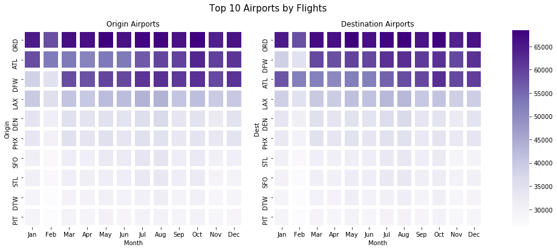


```python
# Sum dataframes
top_10_airports = top_10_origin.rename_axis(index='Airport')+top_10_dest.rename_axis(index='Airport')
top_10_airports['Total'] = top_10_airports.sum(axis=1).astype(np.int64)

# Sorting values
top_10_ap_total = top_10_airports['Total']
top_10_airports = top_10_airports.sort_values(by='Total', ascending=False).iloc[0:10,0:12]
```


```python
# Top 10 airports by total flights
top_10_ap_total.sort_values(ascending=False)
```


    Airport
    ORD    1565539
    ATL    1340568
    DFW    1339165
    LAX     963691
    DEN     816514
    PHX     803589
    SFO     744336
    STL     738563
    DTW     704927
    PIT     689885
    Name: Total, dtype: int64


```python
# Plot size
fig, ax = plt.subplots(figsize=(10,8))
ax.set_title('Top 10 Airports by Total Flights', fontsize=15)
sns.heatmap(top_10_airports.iloc[0:10,0:12], cmap='Blues', linewidths=5, cbar='Blues')

# Show
#plt.tight_layout(pad=3)
plt.savefig('images/charts/top_10_airports_by_total_flights.png')
plt.show()
```


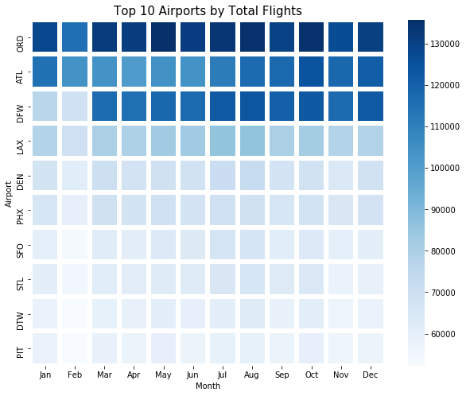


```python
# Dataframe without index
top_10_origin_idx = top_10_origin.reset_index().iloc[:,0:1]

# Renaming column to prepare for df merge
top_10_origin_idx.rename(columns={"Origin":"iata"}, inplace=True)

# Merging dataframes to get the airport description
top_10_origin_desc = pd.merge(left=top_10_origin_idx, right=airports, how='left', on='iata')

# Show airport data
top_10_origin_desc.iloc[:,:-2]
```


<div>
<style scoped>
    .dataframe tbody tr th:only-of-type {
        vertical-align: middle;
    }

    .dataframe tbody tr th {
        vertical-align: top;
    }

    .dataframe thead th {
        text-align: right;
    }
</style>
<table border="1" class="dataframe">
  <thead>
    <tr style="text-align: right;">
      <th></th>
      <th>iata</th>
      <th>airport</th>
      <th>city</th>
      <th>state</th>
      <th>country</th>
    </tr>
  </thead>
  <tbody>
    <tr>
      <th>0</th>
      <td>ORD</td>
      <td>Chicago O'Hare International</td>
      <td>Chicago</td>
      <td>IL</td>
      <td>USA</td>
    </tr>
    <tr>
      <th>1</th>
      <td>ATL</td>
      <td>William B Hartsfield-Atlanta Intl</td>
      <td>Atlanta</td>
      <td>GA</td>
      <td>USA</td>
    </tr>
    <tr>
      <th>2</th>
      <td>DFW</td>
      <td>Dallas-Fort Worth International</td>
      <td>Dallas-Fort Worth</td>
      <td>TX</td>
      <td>USA</td>
    </tr>
    <tr>
      <th>3</th>
      <td>LAX</td>
      <td>Los Angeles International</td>
      <td>Los Angeles</td>
      <td>CA</td>
      <td>USA</td>
    </tr>
    <tr>
      <th>4</th>
      <td>DEN</td>
      <td>Denver Intl</td>
      <td>Denver</td>
      <td>CO</td>
      <td>USA</td>
    </tr>
    <tr>
      <th>5</th>
      <td>PHX</td>
      <td>Phoenix Sky Harbor International</td>
      <td>Phoenix</td>
      <td>AZ</td>
      <td>USA</td>
    </tr>
    <tr>
      <th>6</th>
      <td>SFO</td>
      <td>San Francisco International</td>
      <td>San Francisco</td>
      <td>CA</td>
      <td>USA</td>
    </tr>
    <tr>
      <th>7</th>
      <td>STL</td>
      <td>Lambert-St Louis International</td>
      <td>St Louis</td>
      <td>MO</td>
      <td>USA</td>
    </tr>
    <tr>
      <th>8</th>
      <td>DTW</td>
      <td>Detroit Metropolitan-Wayne County</td>
      <td>Detroit</td>
      <td>MI</td>
      <td>USA</td>
    </tr>
    <tr>
      <th>9</th>
      <td>PIT</td>
      <td>Pittsburgh International</td>
      <td>Pittsburgh</td>
      <td>PA</td>
      <td>USA</td>
    </tr>
  </tbody>
</table>
</div>


```python
top_10_origin_desc['long'].describe()
```


    count     10.000000
    mean     -98.076828
    std       15.373173
    min     -122.374843
    25%     -110.172792
    50%      -93.698595
    75%      -85.296324
    max      -80.232871
    Name: long, dtype: float64


```python
top_10_ap_total.sort_values(ascending=False)
```


    Airport
    ORD    1565539
    ATL    1340568
    DFW    1339165
    LAX     963691
    DEN     816514
    PHX     803589
    SFO     744336
    STL     738563
    DTW     704927
    PIT     689885
    Name: Total, dtype: int64


**Observation 10:** The top 10 airports by total inbound and outbound flights is topped by Chicago O'Hare International in 1st place with 1,565,539 flights. 2nd place is William B Hartsfield-Atlanta International with 1,340,568, and close 3rd is Dallas-Fort Worth International with 1,339,165. During the summer Chicago O'Hare International is very busy with strong demand throughout the year. Atlanta International follows a similar trend but Dallas-Fort Worth International show a weak January and Feburary in terms of total flights.

### 4.2. Airlines by Month vs Average Distance


```python
# Creating a Unique Carrier dataframe
UC1 = df8991['UniqueCarrier'].groupby(df8991['Date'].map(lambda x: x.month)).nunique().dropna()
UC2 = round(df8991['Distance'].groupby(df8991['Date'].map(lambda x: x.month)).mean(), 2)

# Merge and reindex dataframes
carriers_month_v_distance = pd.merge(left=UC1, right=UC2, how='left', on='Date')
carriers_month_v_distance = carriers_month_v_distance.rename(index={1: 'Jan', 2: 'Feb', 3: 'Mar', 4: 'Apr', 5: 'May', 6: 'Jun',
                                                                    7: 'Jul', 8: 'Aug', 9: 'Sep', 10: 'Oct', 11: 'Nov', 12: 'Dec'})
# Rename Columns
carriers_month_v_distance.rename_axis("Month", axis="index", inplace=True)
carriers_month_v_distance.rename(columns = {'UniqueCarrier':'CarrierCount'},inplace=True)

# Saving as a new dataframe
carriers_month_v_distance = pd.DataFrame(carriers_month_v_distance)

# Show
carriers_month_v_distance
```


<div>
<style scoped>
    .dataframe tbody tr th:only-of-type {
        vertical-align: middle;
    }

    .dataframe tbody tr th {
        vertical-align: top;
    }

    .dataframe thead th {
        text-align: right;
    }
</style>
<table border="1" class="dataframe">
  <thead>
    <tr style="text-align: right;">
      <th></th>
      <th>CarrierCount</th>
      <th>Distance</th>
    </tr>
    <tr>
      <th>Month</th>
      <th></th>
      <th></th>
    </tr>
  </thead>
  <tbody>
    <tr>
      <th>Jan</th>
      <td>14</td>
      <td>619.77</td>
    </tr>
    <tr>
      <th>Feb</th>
      <td>14</td>
      <td>623.41</td>
    </tr>
    <tr>
      <th>Mar</th>
      <td>14</td>
      <td>630.20</td>
    </tr>
    <tr>
      <th>Apr</th>
      <td>14</td>
      <td>628.60</td>
    </tr>
    <tr>
      <th>May</th>
      <td>14</td>
      <td>629.13</td>
    </tr>
    <tr>
      <th>Jun</th>
      <td>14</td>
      <td>635.24</td>
    </tr>
    <tr>
      <th>Jul</th>
      <td>14</td>
      <td>640.34</td>
    </tr>
    <tr>
      <th>Aug</th>
      <td>14</td>
      <td>639.94</td>
    </tr>
    <tr>
      <th>Sep</th>
      <td>13</td>
      <td>635.37</td>
    </tr>
    <tr>
      <th>Oct</th>
      <td>13</td>
      <td>634.70</td>
    </tr>
    <tr>
      <th>Nov</th>
      <td>12</td>
      <td>636.83</td>
    </tr>
    <tr>
      <th>Dec</th>
      <td>12</td>
      <td>640.03</td>
    </tr>
  </tbody>
</table>
</div>


```python
# Creating a combo chart
fig, ax1 = plt.subplots(figsize=(10,6))
color = 'tab:green'

# Creating Bar Plot
ax1.set_title('Airlines by Month vs Average Distance', fontsize=15)
ax1 = sns.barplot(x='Month', y='CarrierCount', data=carriers_month_v_distance.reset_index(), palette='summer')
ax1.set_xlabel('Month', fontsize=13)
ax1.set_ylabel('Carriers', fontsize=13, color=color, weight='bold')
ax1.tick_params(axis='y')

# Sharing the same x-axis
ax2 = ax1.twinx()
color = 'tab:red'

# Creating Line Plot
ax2 = sns.lineplot(x='Month', y='Distance', data=carriers_month_v_distance.reset_index(), 
                   sort=False, color=color, linewidth = 2, marker='o')
ax2.set_ylabel('\nAverage Distance (Mi)', fontsize=13, color=color, weight='bold')
ax2.tick_params(axis='y', color=color)

# Show
#plt.tight_layout(pad=3)
plt.savefig('images/charts/airlines_by_month_vs_distance.png')
plt.show()
```


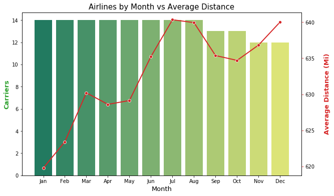


**Observation 11:** On average, we can count around 12-14 carriers on any given month but the chart shows us from September the amount of carriers reduces into December suggesting reduced holidays. The opposite seems true when we look at average distance travelled by month. This number is increaing from 620 miles on average to 640 miles suggesting fewer longer flights. This correlation suggests perhaps passengers are flying less often but further in the winter than the summer. This could mean going from a cold country to a hotter country or going to see family for the festive season in December. 

### 4.3. Average Flight Delay vs Distance


```python
# Creating a dataframe
DD1 = df8991['DepDelay'].groupby(df8991['Date'].map(lambda x: x.day)).mean()
DD2 = df8991['ArrDelay'].groupby(df8991['Date'].map(lambda x: x.day)).mean()
DD3 = df8991['Distance'].groupby(df8991['Date'].map(lambda x: x.day)).mean()

# Merge and reindex dataframes
delay_v_distance = pd.merge(left=DD1, right=DD2, how='left', on='Date')
delay_v_distance = pd.merge(left=delay_v_distance, right=DD3, how='left', on='Date')

# Saving as a new dataframe
delay_v_distance = pd.DataFrame(delay_v_distance)

# Show
delay_v_distance
```


<div>
<style scoped>
    .dataframe tbody tr th:only-of-type {
        vertical-align: middle;
    }

    .dataframe tbody tr th {
        vertical-align: top;
    }

    .dataframe thead th {
        text-align: right;
    }
</style>
<table border="1" class="dataframe">
  <thead>
    <tr style="text-align: right;">
      <th></th>
      <th>DepDelay</th>
      <th>ArrDelay</th>
      <th>Distance</th>
    </tr>
    <tr>
      <th>Date</th>
      <th></th>
      <th></th>
      <th></th>
    </tr>
  </thead>
  <tbody>
    <tr>
      <th>1</th>
      <td>6.756960</td>
      <td>6.279760</td>
      <td>633.227517</td>
    </tr>
    <tr>
      <th>2</th>
      <td>7.148581</td>
      <td>7.067214</td>
      <td>633.218274</td>
    </tr>
    <tr>
      <th>3</th>
      <td>7.722741</td>
      <td>7.702845</td>
      <td>633.915910</td>
    </tr>
    <tr>
      <th>4</th>
      <td>6.065070</td>
      <td>5.623313</td>
      <td>633.371921</td>
    </tr>
    <tr>
      <th>5</th>
      <td>6.034198</td>
      <td>5.818042</td>
      <td>632.001161</td>
    </tr>
    <tr>
      <th>6</th>
      <td>6.525807</td>
      <td>6.330133</td>
      <td>631.732588</td>
    </tr>
    <tr>
      <th>7</th>
      <td>6.092675</td>
      <td>5.939208</td>
      <td>632.502854</td>
    </tr>
    <tr>
      <th>8</th>
      <td>6.242835</td>
      <td>6.140405</td>
      <td>632.523106</td>
    </tr>
    <tr>
      <th>9</th>
      <td>6.557927</td>
      <td>6.414992</td>
      <td>632.940562</td>
    </tr>
    <tr>
      <th>10</th>
      <td>6.341829</td>
      <td>6.056148</td>
      <td>632.540616</td>
    </tr>
    <tr>
      <th>11</th>
      <td>6.260230</td>
      <td>5.892138</td>
      <td>631.703551</td>
    </tr>
    <tr>
      <th>12</th>
      <td>5.819695</td>
      <td>5.567792</td>
      <td>630.539311</td>
    </tr>
    <tr>
      <th>13</th>
      <td>5.723200</td>
      <td>5.511132</td>
      <td>631.097914</td>
    </tr>
    <tr>
      <th>14</th>
      <td>6.827372</td>
      <td>6.880148</td>
      <td>632.665304</td>
    </tr>
    <tr>
      <th>15</th>
      <td>7.680069</td>
      <td>7.815735</td>
      <td>632.968215</td>
    </tr>
    <tr>
      <th>16</th>
      <td>7.398344</td>
      <td>7.318719</td>
      <td>633.384753</td>
    </tr>
    <tr>
      <th>17</th>
      <td>6.888403</td>
      <td>6.965868</td>
      <td>632.278565</td>
    </tr>
    <tr>
      <th>18</th>
      <td>6.953599</td>
      <td>7.174428</td>
      <td>632.314703</td>
    </tr>
    <tr>
      <th>19</th>
      <td>7.576420</td>
      <td>7.859780</td>
      <td>631.405105</td>
    </tr>
    <tr>
      <th>20</th>
      <td>8.048997</td>
      <td>8.234841</td>
      <td>632.202658</td>
    </tr>
    <tr>
      <th>21</th>
      <td>8.192566</td>
      <td>8.112351</td>
      <td>633.127681</td>
    </tr>
    <tr>
      <th>22</th>
      <td>8.683596</td>
      <td>8.583389</td>
      <td>633.981356</td>
    </tr>
    <tr>
      <th>23</th>
      <td>7.389391</td>
      <td>6.976880</td>
      <td>634.602349</td>
    </tr>
    <tr>
      <th>24</th>
      <td>5.878058</td>
      <td>5.063008</td>
      <td>634.855267</td>
    </tr>
    <tr>
      <th>25</th>
      <td>5.817795</td>
      <td>5.020933</td>
      <td>633.658841</td>
    </tr>
    <tr>
      <th>26</th>
      <td>6.168475</td>
      <td>5.591412</td>
      <td>631.978279</td>
    </tr>
    <tr>
      <th>27</th>
      <td>6.972767</td>
      <td>6.594828</td>
      <td>632.447910</td>
    </tr>
    <tr>
      <th>28</th>
      <td>7.683362</td>
      <td>7.301313</td>
      <td>634.785688</td>
    </tr>
    <tr>
      <th>29</th>
      <td>6.662649</td>
      <td>6.500185</td>
      <td>635.010834</td>
    </tr>
    <tr>
      <th>30</th>
      <td>6.456550</td>
      <td>6.135588</td>
      <td>634.696271</td>
    </tr>
    <tr>
      <th>31</th>
      <td>7.340170</td>
      <td>6.895714</td>
      <td>635.679141</td>
    </tr>
  </tbody>
</table>
</div>


```python
# Delay with distance correlation
delay_v_distance.corr()
```


<div>
<style scoped>
    .dataframe tbody tr th:only-of-type {
        vertical-align: middle;
    }

    .dataframe tbody tr th {
        vertical-align: top;
    }

    .dataframe thead th {
        text-align: right;
    }
</style>
<table border="1" class="dataframe">
  <thead>
    <tr style="text-align: right;">
      <th></th>
      <th>DepDelay</th>
      <th>ArrDelay</th>
      <th>Distance</th>
    </tr>
  </thead>
  <tbody>
    <tr>
      <th>DepDelay</th>
      <td>1.000000</td>
      <td>0.969679</td>
      <td>0.305120</td>
    </tr>
    <tr>
      <th>ArrDelay</th>
      <td>0.969679</td>
      <td>1.000000</td>
      <td>0.149177</td>
    </tr>
    <tr>
      <th>Distance</th>
      <td>0.305120</td>
      <td>0.149177</td>
      <td>1.000000</td>
    </tr>
  </tbody>
</table>
</div>


```python
delay_v_distance['TotalDelay'] = delay_v_distance['DepDelay']+delay_v_distance['ArrDelay']
delay_v_distance.corr()
```


<div>
<style scoped>
    .dataframe tbody tr th:only-of-type {
        vertical-align: middle;
    }

    .dataframe tbody tr th {
        vertical-align: top;
    }

    .dataframe thead th {
        text-align: right;
    }
</style>
<table border="1" class="dataframe">
  <thead>
    <tr style="text-align: right;">
      <th></th>
      <th>DepDelay</th>
      <th>ArrDelay</th>
      <th>Distance</th>
      <th>TotalDelay</th>
    </tr>
  </thead>
  <tbody>
    <tr>
      <th>DepDelay</th>
      <td>1.000000</td>
      <td>0.969679</td>
      <td>0.305120</td>
      <td>0.990868</td>
    </tr>
    <tr>
      <th>ArrDelay</th>
      <td>0.969679</td>
      <td>1.000000</td>
      <td>0.149177</td>
      <td>0.993775</td>
    </tr>
    <tr>
      <th>Distance</th>
      <td>0.305120</td>
      <td>0.149177</td>
      <td>1.000000</td>
      <td>0.221398</td>
    </tr>
    <tr>
      <th>TotalDelay</th>
      <td>0.990868</td>
      <td>0.993775</td>
      <td>0.221398</td>
      <td>1.000000</td>
    </tr>
  </tbody>
</table>
</div>


```python
fig, (ax1, ax2) = plt.subplots(1,2, figsize=(15,6), gridspec_kw={'width_ratios':[1,1]})

# Plot
fig.suptitle('Daily Avg. Flight Delay vs Distance', fontsize=15)
sb.regplot(data = delay_v_distance, x = 'DepDelay', y = 'Distance', ax=ax1)
sb.regplot(data = delay_v_distance, x = 'ArrDelay', y = 'Distance', ax=ax2)

# Labels
ax1.title.set_text('')
ax1.set_xlabel('Departure Delay (Min)')
ax1.set_ylabel('Distance (Mi)')

ax2.title.set_text('')
ax2.set_xlabel('Arrival Delay (Min)')
ax2.set_ylabel('')

# Show
#plt.tight_layout(pad=3)
plt.subplots_adjust(top=0.9)
plt.savefig('images/charts/delay_vs_distance.png')
plt.show()
```


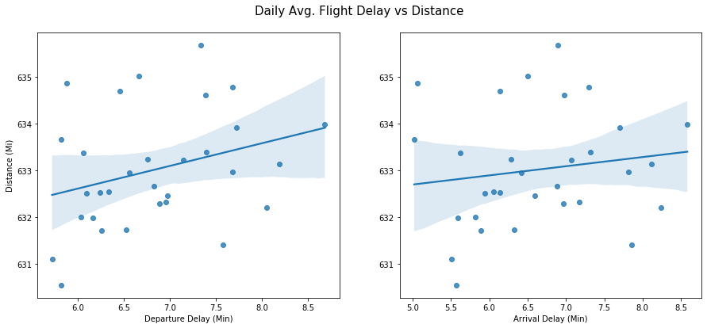


**Observation 12:** There doesn't seem to be a clear correlation between the distance and departure or arrival delay but we can clearly see one when we add a line of best fit. We can clearly observe a positive correlation in both plots indicating as the flight distance increases the greater chance of delay increases too. Please keep in mind that we are using a daily average here to plot this data because millions of data points would not be clear.

<a id='univariate'></a>
## Step 5: Univariate Exploration 📈

### 5.1. Routes by Flights, Airline and Average Delay


```python
# Dataframe from columns
flight_route = df8991[['Origin','Dest']]

# Creating a new dataframe
flight_route = pd.DataFrame(flight_route)

# Creating columns
flight_route['Route'] = flight_route['Origin'].str.cat(flight_route['Dest'],sep=" - ")
flight_route['AverageDelay'] = df8991['DepDelay']+df8991['ArrDelay']
flight_route['Carrier'] = df8991['UniqueCarrier']
flight_route.head()
```


<div>
<style scoped>
    .dataframe tbody tr th:only-of-type {
        vertical-align: middle;
    }

    .dataframe tbody tr th {
        vertical-align: top;
    }

    .dataframe thead th {
        text-align: right;
    }
</style>
<table border="1" class="dataframe">
  <thead>
    <tr style="text-align: right;">
      <th></th>
      <th>Origin</th>
      <th>Dest</th>
      <th>Route</th>
      <th>AverageDelay</th>
      <th>Carrier</th>
    </tr>
  </thead>
  <tbody>
    <tr>
      <th>0</th>
      <td>SFO</td>
      <td>HNL</td>
      <td>SFO - HNL</td>
      <td>219</td>
      <td>UA</td>
    </tr>
    <tr>
      <th>1</th>
      <td>SFO</td>
      <td>HNL</td>
      <td>SFO - HNL</td>
      <td>45</td>
      <td>UA</td>
    </tr>
    <tr>
      <th>2</th>
      <td>SFO</td>
      <td>HNL</td>
      <td>SFO - HNL</td>
      <td>-19</td>
      <td>UA</td>
    </tr>
    <tr>
      <th>3</th>
      <td>SFO</td>
      <td>HNL</td>
      <td>SFO - HNL</td>
      <td>-29</td>
      <td>UA</td>
    </tr>
    <tr>
      <th>4</th>
      <td>SFO</td>
      <td>HNL</td>
      <td>SFO - HNL</td>
      <td>-37</td>
      <td>UA</td>
    </tr>
  </tbody>
</table>
</div>


```python
flight_route.groupby(['Carrier', 'Route'])['AverageDelay'].mean().head()
```


    Carrier  Route    
    AA       ABE - ALB    33.00000
             ABE - BDL     1.00000
             ABE - MDT    16.00000
             ABE - ORD     6.97619
             ABQ - DEN    52.00000
    Name: AverageDelay, dtype: float64


```python
# Top carriers by average delay 
flight_route.groupby('Carrier')['AverageDelay'].mean().sort_values(ascending=False)
```


    Carrier
    PI        25.816885
    UA        16.953211
    DL        15.099069
    EA        14.285615
    WN        14.058281
    US        13.584921
    TW        13.468342
    CO        12.723660
    HP        11.795458
    AA        11.353261
    ML (1)    10.940089
    AS        10.922795
    PA (1)     9.541804
    NW         8.327834
    Name: AverageDelay, dtype: float64


```python
# Top routes by average delay 
flight_route.groupby('Route')['AverageDelay'].mean().sort_values(ascending=False).iloc[0:10]
```


    Route
    GUC - HDN    1980.000000
    ICT - PDX     446.000000
    BHM - LIT     407.000000
    AMA - SLC     351.000000
    MCI - ELP     271.000000
    CLE - DAY     231.000000
    SGF - TUL     220.333333
    DCA - PHL     211.500000
    TUL - MSP     204.000000
    ORD - SUX     174.000000
    Name: AverageDelay, dtype: float64


```python
# Top carriers by total routes
flight_route.groupby('Carrier')['Route'].count().sort_values(ascending=False)
```


    Carrier
    US        2575160
    DL        2430469
    AA        2084513
    UA        1774850
    NW        1352989
    CO        1241287
    WN         950837
    TW         756992
    HP         623477
    EA         398362
    PI         281905
    AS         267975
    PA (1)     223079
    ML (1)      69119
    Name: Route, dtype: int64


```python
# Top routes by flights
flight_route['Route'].value_counts().iloc[0:10]
```


    SFO - LAX    69180
    LAX - SFO    68754
    LAX - PHX    39321
    PHX - LAX    38756
    LAX - LAS    31549
    PHX - LAS    30778
    LAS - LAX    30296
    LAS - PHX    29775
    LGA - ORD    29656
    ORD - MSP    29308
    Name: Route, dtype: int64


```python
# Creating a new dataframe
top_10_flight_route = pd.DataFrame(flight_route['Route'].value_counts().iloc[0:10])
top_10_flight_route
```


<div>
<style scoped>
    .dataframe tbody tr th:only-of-type {
        vertical-align: middle;
    }

    .dataframe tbody tr th {
        vertical-align: top;
    }

    .dataframe thead th {
        text-align: right;
    }
</style>
<table border="1" class="dataframe">
  <thead>
    <tr style="text-align: right;">
      <th></th>
      <th>Route</th>
    </tr>
  </thead>
  <tbody>
    <tr>
      <th>SFO - LAX</th>
      <td>69180</td>
    </tr>
    <tr>
      <th>LAX - SFO</th>
      <td>68754</td>
    </tr>
    <tr>
      <th>LAX - PHX</th>
      <td>39321</td>
    </tr>
    <tr>
      <th>PHX - LAX</th>
      <td>38756</td>
    </tr>
    <tr>
      <th>LAX - LAS</th>
      <td>31549</td>
    </tr>
    <tr>
      <th>PHX - LAS</th>
      <td>30778</td>
    </tr>
    <tr>
      <th>LAS - LAX</th>
      <td>30296</td>
    </tr>
    <tr>
      <th>LAS - PHX</th>
      <td>29775</td>
    </tr>
    <tr>
      <th>LGA - ORD</th>
      <td>29656</td>
    </tr>
    <tr>
      <th>ORD - MSP</th>
      <td>29308</td>
    </tr>
  </tbody>
</table>
</div>


```python
# Creating list
delay_list = []
item0 = list(flight_route[flight_route['Route'] == top_10_flight_route.reset_index()['index'].loc[0]].mean())
item1 = list(flight_route[flight_route['Route'] == top_10_flight_route.reset_index()['index'].loc[1]].mean())
item2 = list(flight_route[flight_route['Route'] == top_10_flight_route.reset_index()['index'].loc[2]].mean())
item3 = list(flight_route[flight_route['Route'] == top_10_flight_route.reset_index()['index'].loc[3]].mean())
item4 = list(flight_route[flight_route['Route'] == top_10_flight_route.reset_index()['index'].loc[4]].mean())
item5 = list(flight_route[flight_route['Route'] == top_10_flight_route.reset_index()['index'].loc[5]].mean())
item6 = list(flight_route[flight_route['Route'] == top_10_flight_route.reset_index()['index'].loc[6]].mean())
item7 = list(flight_route[flight_route['Route'] == top_10_flight_route.reset_index()['index'].loc[7]].mean())
item8 = list(flight_route[flight_route['Route'] == top_10_flight_route.reset_index()['index'].loc[8]].mean())
item9 = list(flight_route[flight_route['Route'] == top_10_flight_route.reset_index()['index'].loc[9]].mean())

# Creating a new dataframe
delay_list.append(item0+item1+item2+item3+item4+item5+item6+item7+item8+item9)
top_10_flight_delay = pd.DataFrame(delay_list)
top_10_flight_delay = pd.melt(top_10_flight_delay).drop(['variable'], axis=1).rename(columns={"value":"AverageDelay"})
top_10_flight_delay.index = top_10_flight_route.index
top_10_flight_delay
```


<div>
<style scoped>
    .dataframe tbody tr th:only-of-type {
        vertical-align: middle;
    }

    .dataframe tbody tr th {
        vertical-align: top;
    }

    .dataframe thead th {
        text-align: right;
    }
</style>
<table border="1" class="dataframe">
  <thead>
    <tr style="text-align: right;">
      <th></th>
      <th>AverageDelay</th>
    </tr>
  </thead>
  <tbody>
    <tr>
      <th>SFO - LAX</th>
      <td>14.286889</td>
    </tr>
    <tr>
      <th>LAX - SFO</th>
      <td>18.972918</td>
    </tr>
    <tr>
      <th>LAX - PHX</th>
      <td>15.574909</td>
    </tr>
    <tr>
      <th>PHX - LAX</th>
      <td>16.178011</td>
    </tr>
    <tr>
      <th>LAX - LAS</th>
      <td>11.177407</td>
    </tr>
    <tr>
      <th>PHX - LAS</th>
      <td>15.854929</td>
    </tr>
    <tr>
      <th>LAS - LAX</th>
      <td>11.442567</td>
    </tr>
    <tr>
      <th>LAS - PHX</th>
      <td>14.501092</td>
    </tr>
    <tr>
      <th>LGA - ORD</th>
      <td>14.211762</td>
    </tr>
    <tr>
      <th>ORD - MSP</th>
      <td>14.661662</td>
    </tr>
  </tbody>
</table>
</div>


```python
top_10_flight_route = pd.concat([top_10_flight_route, top_10_flight_delay], axis=1, join_axes=[top_10_flight_route.index])
top_10_flight_route.rename(columns={"Route":"Flights"}, inplace=True)
top_10_flight_route['AverageDelay'] = round(top_10_flight_route['AverageDelay'], 2)
top_10_flight_route.index.name = 'Route'
```


```python
top_10_flight_route
```


<div>
<style scoped>
    .dataframe tbody tr th:only-of-type {
        vertical-align: middle;
    }

    .dataframe tbody tr th {
        vertical-align: top;
    }

    .dataframe thead th {
        text-align: right;
    }
</style>
<table border="1" class="dataframe">
  <thead>
    <tr style="text-align: right;">
      <th></th>
      <th>Flights</th>
      <th>AverageDelay</th>
    </tr>
    <tr>
      <th>Route</th>
      <th></th>
      <th></th>
    </tr>
  </thead>
  <tbody>
    <tr>
      <th>SFO - LAX</th>
      <td>69180</td>
      <td>14.29</td>
    </tr>
    <tr>
      <th>LAX - SFO</th>
      <td>68754</td>
      <td>18.97</td>
    </tr>
    <tr>
      <th>LAX - PHX</th>
      <td>39321</td>
      <td>15.57</td>
    </tr>
    <tr>
      <th>PHX - LAX</th>
      <td>38756</td>
      <td>16.18</td>
    </tr>
    <tr>
      <th>LAX - LAS</th>
      <td>31549</td>
      <td>11.18</td>
    </tr>
    <tr>
      <th>PHX - LAS</th>
      <td>30778</td>
      <td>15.85</td>
    </tr>
    <tr>
      <th>LAS - LAX</th>
      <td>30296</td>
      <td>11.44</td>
    </tr>
    <tr>
      <th>LAS - PHX</th>
      <td>29775</td>
      <td>14.50</td>
    </tr>
    <tr>
      <th>LGA - ORD</th>
      <td>29656</td>
      <td>14.21</td>
    </tr>
    <tr>
      <th>ORD - MSP</th>
      <td>29308</td>
      <td>14.66</td>
    </tr>
  </tbody>
</table>
</div>


```python
# Creating a dataframe for average delay by route and carrier
carrier_route_delay = pd.DataFrame(flight_route.groupby(['Carrier', 'Route'])['AverageDelay'].mean())
carrier_route_delay.head()
```


<div>
<style scoped>
    .dataframe tbody tr th:only-of-type {
        vertical-align: middle;
    }

    .dataframe tbody tr th {
        vertical-align: top;
    }

    .dataframe thead th {
        text-align: right;
    }
</style>
<table border="1" class="dataframe">
  <thead>
    <tr style="text-align: right;">
      <th></th>
      <th></th>
      <th>AverageDelay</th>
    </tr>
    <tr>
      <th>Carrier</th>
      <th>Route</th>
      <th></th>
    </tr>
  </thead>
  <tbody>
    <tr>
      <th rowspan="5" valign="top">AA</th>
      <th>ABE - ALB</th>
      <td>33.00000</td>
    </tr>
    <tr>
      <th>ABE - BDL</th>
      <td>1.00000</td>
    </tr>
    <tr>
      <th>ABE - MDT</th>
      <td>16.00000</td>
    </tr>
    <tr>
      <th>ABE - ORD</th>
      <td>6.97619</td>
    </tr>
    <tr>
      <th>ABQ - DEN</th>
      <td>52.00000</td>
    </tr>
  </tbody>
</table>
</div>


```python
carrier_route_delay.filter(like='SFO - LAX', axis=0)
```


<div>
<style scoped>
    .dataframe tbody tr th:only-of-type {
        vertical-align: middle;
    }

    .dataframe tbody tr th {
        vertical-align: top;
    }

    .dataframe thead th {
        text-align: right;
    }
</style>
<table border="1" class="dataframe">
  <thead>
    <tr style="text-align: right;">
      <th></th>
      <th></th>
      <th>AverageDelay</th>
    </tr>
    <tr>
      <th>Carrier</th>
      <th>Route</th>
      <th></th>
    </tr>
  </thead>
  <tbody>
    <tr>
      <th>AA</th>
      <th>SFO - LAX</th>
      <td>6.917208</td>
    </tr>
    <tr>
      <th>AS</th>
      <th>SFO - LAX</th>
      <td>20.866279</td>
    </tr>
    <tr>
      <th>CO</th>
      <th>SFO - LAX</th>
      <td>12.990581</td>
    </tr>
    <tr>
      <th>DL</th>
      <th>SFO - LAX</th>
      <td>13.237706</td>
    </tr>
    <tr>
      <th>NW</th>
      <th>SFO - LAX</th>
      <td>20.851767</td>
    </tr>
    <tr>
      <th>PA (1)</th>
      <th>SFO - LAX</th>
      <td>8.613192</td>
    </tr>
    <tr>
      <th>TW</th>
      <th>SFO - LAX</th>
      <td>13.563017</td>
    </tr>
    <tr>
      <th>UA</th>
      <th>SFO - LAX</th>
      <td>17.250478</td>
    </tr>
    <tr>
      <th>US</th>
      <th>SFO - LAX</th>
      <td>17.044848</td>
    </tr>
  </tbody>
</table>
</div>


```python
# Get index names
carrier_route_delay.index.names
```


    FrozenList(['Carrier', 'Route'])


```python
list(carrier_route_delay.index[0])
```


    ['AA', 'ABE - ALB']


```python
carrier_route_delay['RouteIndex'] = carrier_route_delay.reset_index(level=0, drop=True).index #.reset_index(level=0, drop=True) #.str.extractall(r"(A-Z)").index
carrier_route_delay['RouteIndex'] = carrier_route_delay['RouteIndex']
carrier_route_delay.head()
```


<div>
<style scoped>
    .dataframe tbody tr th:only-of-type {
        vertical-align: middle;
    }

    .dataframe tbody tr th {
        vertical-align: top;
    }

    .dataframe thead th {
        text-align: right;
    }
</style>
<table border="1" class="dataframe">
  <thead>
    <tr style="text-align: right;">
      <th></th>
      <th></th>
      <th>AverageDelay</th>
      <th>RouteIndex</th>
    </tr>
    <tr>
      <th>Carrier</th>
      <th>Route</th>
      <th></th>
      <th></th>
    </tr>
  </thead>
  <tbody>
    <tr>
      <th rowspan="5" valign="top">AA</th>
      <th>ABE - ALB</th>
      <td>33.00000</td>
      <td>ABE - ALB</td>
    </tr>
    <tr>
      <th>ABE - BDL</th>
      <td>1.00000</td>
      <td>ABE - BDL</td>
    </tr>
    <tr>
      <th>ABE - MDT</th>
      <td>16.00000</td>
      <td>ABE - MDT</td>
    </tr>
    <tr>
      <th>ABE - ORD</th>
      <td>6.97619</td>
      <td>ABE - ORD</td>
    </tr>
    <tr>
      <th>ABQ - DEN</th>
      <td>52.00000</td>
      <td>ABQ - DEN</td>
    </tr>
  </tbody>
</table>
</div>


```python
carrier_route_delay['RouteIndex'].iloc[0]
```


    'ABE - ALB'


```python
carrier_route_delay.filter(like="ABE - ALB", axis=0)
```


<div>
<style scoped>
    .dataframe tbody tr th:only-of-type {
        vertical-align: middle;
    }

    .dataframe tbody tr th {
        vertical-align: top;
    }

    .dataframe thead th {
        text-align: right;
    }
</style>
<table border="1" class="dataframe">
  <thead>
    <tr style="text-align: right;">
      <th></th>
      <th></th>
      <th>AverageDelay</th>
      <th>RouteIndex</th>
    </tr>
    <tr>
      <th>Carrier</th>
      <th>Route</th>
      <th></th>
      <th></th>
    </tr>
  </thead>
  <tbody>
    <tr>
      <th>AA</th>
      <th>ABE - ALB</th>
      <td>33.0</td>
      <td>ABE - ALB</td>
    </tr>
  </tbody>
</table>
</div>


```python
carrier_route_delay.filter(like=top_10_flight_route.index[1], axis=0)
```


<div>
<style scoped>
    .dataframe tbody tr th:only-of-type {
        vertical-align: middle;
    }

    .dataframe tbody tr th {
        vertical-align: top;
    }

    .dataframe thead th {
        text-align: right;
    }
</style>
<table border="1" class="dataframe">
  <thead>
    <tr style="text-align: right;">
      <th></th>
      <th></th>
      <th>AverageDelay</th>
      <th>RouteIndex</th>
    </tr>
    <tr>
      <th>Carrier</th>
      <th>Route</th>
      <th></th>
      <th></th>
    </tr>
  </thead>
  <tbody>
    <tr>
      <th>AA</th>
      <th>LAX - SFO</th>
      <td>8.280271</td>
      <td>LAX - SFO</td>
    </tr>
    <tr>
      <th>AS</th>
      <th>LAX - SFO</th>
      <td>22.179775</td>
      <td>LAX - SFO</td>
    </tr>
    <tr>
      <th>CO</th>
      <th>LAX - SFO</th>
      <td>19.412461</td>
      <td>LAX - SFO</td>
    </tr>
    <tr>
      <th>DL</th>
      <th>LAX - SFO</th>
      <td>21.431304</td>
      <td>LAX - SFO</td>
    </tr>
    <tr>
      <th>NW</th>
      <th>LAX - SFO</th>
      <td>19.772613</td>
      <td>LAX - SFO</td>
    </tr>
    <tr>
      <th>PA (1)</th>
      <th>LAX - SFO</th>
      <td>21.444831</td>
      <td>LAX - SFO</td>
    </tr>
    <tr>
      <th>TW</th>
      <th>LAX - SFO</th>
      <td>32.326835</td>
      <td>LAX - SFO</td>
    </tr>
    <tr>
      <th>UA</th>
      <th>LAX - SFO</th>
      <td>20.176455</td>
      <td>LAX - SFO</td>
    </tr>
    <tr>
      <th>US</th>
      <th>LAX - SFO</th>
      <td>20.680116</td>
      <td>LAX - SFO</td>
    </tr>
  </tbody>
</table>
</div>


```python
carrier_route_delay.drop(['RouteIndex'], axis=1, inplace=True)
```


```python
# Merge index 0-1
item0 = carrier_route_delay.filter(like=top_10_flight_route.index[0], axis=0)
item1 = carrier_route_delay.filter(like=top_10_flight_route.index[1], axis=0)
item0_1 = item0.merge(item1, how="outer", on="AverageDelay", left_index=True, right_index=True)

# Merge index 2-3
item2 = carrier_route_delay.filter(like=top_10_flight_route.index[2], axis=0)
item3 = carrier_route_delay.filter(like=top_10_flight_route.index[3], axis=0)
item2_3 = item2.merge(item3, how="outer", on="AverageDelay", left_index=True, right_index=True)
merge0_3 = item0_1.merge(item2_3, how="outer", on="AverageDelay", left_index=True, right_index=True)

# Merge index 4-5
item4 = carrier_route_delay.filter(like=top_10_flight_route.index[4], axis=0)
item5 = carrier_route_delay.filter(like=top_10_flight_route.index[5], axis=0)
item4_5 = item4.merge(item5, how="outer", on="AverageDelay", left_index=True, right_index=True)
merge0_5 = merge0_3.merge(item4_5, how="outer", on="AverageDelay", left_index=True, right_index=True)

# Merge index 6-7
item6 = carrier_route_delay.filter(like=top_10_flight_route.index[6], axis=0)
item7 = carrier_route_delay.filter(like=top_10_flight_route.index[7], axis=0)
item6_7 = item5.merge(item6, how="outer", on="AverageDelay", left_index=True, right_index=True)
merge0_7 = merge0_5.merge(item6_7, how="outer", on="AverageDelay", left_index=True, right_index=True)

# Merge index 8-9
item8 = carrier_route_delay.filter(like=top_10_flight_route.index[8], axis=0)
item9 = carrier_route_delay.filter(like=top_10_flight_route.index[9], axis=0)
item8_9 = item8.merge(item9, how="outer", on="AverageDelay", left_index=True, right_index=True)
merge0_9 = merge0_7.merge(item8_9, how="outer", on="AverageDelay", left_index=True, right_index=True)

# Print dataframe
carrier_ra = merge0_9
carrier_ra
```


<div>
<style scoped>
    .dataframe tbody tr th:only-of-type {
        vertical-align: middle;
    }

    .dataframe tbody tr th {
        vertical-align: top;
    }

    .dataframe thead th {
        text-align: right;
    }
</style>
<table border="1" class="dataframe">
  <thead>
    <tr style="text-align: right;">
      <th></th>
      <th></th>
      <th>AverageDelay</th>
    </tr>
    <tr>
      <th>Carrier</th>
      <th>Route</th>
      <th></th>
    </tr>
  </thead>
  <tbody>
    <tr>
      <th rowspan="6" valign="top">AA</th>
      <th>LAS - LAX</th>
      <td>-0.577778</td>
    </tr>
    <tr>
      <th>LAX - LAS</th>
      <td>1.730290</td>
    </tr>
    <tr>
      <th>LAX - SFO</th>
      <td>8.280271</td>
    </tr>
    <tr>
      <th>LGA - ORD</th>
      <td>14.982707</td>
    </tr>
    <tr>
      <th>ORD - MSP</th>
      <td>19.809837</td>
    </tr>
    <tr>
      <th>SFO - LAX</th>
      <td>6.917208</td>
    </tr>
    <tr>
      <th rowspan="2" valign="top">AS</th>
      <th>LAX - SFO</th>
      <td>22.179775</td>
    </tr>
    <tr>
      <th>SFO - LAX</th>
      <td>20.866279</td>
    </tr>
    <tr>
      <th rowspan="4" valign="top">CO</th>
      <th>LAS - LAX</th>
      <td>6.295775</td>
    </tr>
    <tr>
      <th>LAX - LAS</th>
      <td>2.410959</td>
    </tr>
    <tr>
      <th>LAX - SFO</th>
      <td>19.412461</td>
    </tr>
    <tr>
      <th>SFO - LAX</th>
      <td>12.990581</td>
    </tr>
    <tr>
      <th rowspan="7" valign="top">DL</th>
      <th>LAS - LAX</th>
      <td>11.196488</td>
    </tr>
    <tr>
      <th>LAX - LAS</th>
      <td>13.751666</td>
    </tr>
    <tr>
      <th>LAX - PHX</th>
      <td>16.196706</td>
    </tr>
    <tr>
      <th>LAX - SFO</th>
      <td>21.431304</td>
    </tr>
    <tr>
      <th>PHX - LAS</th>
      <td>24.553367</td>
    </tr>
    <tr>
      <th>PHX - LAX</th>
      <td>13.126173</td>
    </tr>
    <tr>
      <th>SFO - LAX</th>
      <td>13.237706</td>
    </tr>
    <tr>
      <th rowspan="5" valign="top">HP</th>
      <th>LAS - LAX</th>
      <td>13.548347</td>
    </tr>
    <tr>
      <th>LAX - LAS</th>
      <td>8.688118</td>
    </tr>
    <tr>
      <th>LAX - PHX</th>
      <td>13.020739</td>
    </tr>
    <tr>
      <th>PHX - LAS</th>
      <td>15.177153</td>
    </tr>
    <tr>
      <th>PHX - LAX</th>
      <td>15.904401</td>
    </tr>
    <tr>
      <th rowspan="3" valign="top">ML (1)</th>
      <th>LAS - LAX</th>
      <td>118.200000</td>
    </tr>
    <tr>
      <th>LAX - LAS</th>
      <td>54.857143</td>
    </tr>
    <tr>
      <th>PHX - LAS</th>
      <td>30.956522</td>
    </tr>
    <tr>
      <th rowspan="3" valign="top">NW</th>
      <th>LAX - SFO</th>
      <td>19.772613</td>
    </tr>
    <tr>
      <th>ORD - MSP</th>
      <td>11.556449</td>
    </tr>
    <tr>
      <th>SFO - LAX</th>
      <td>20.851767</td>
    </tr>
    <tr>
      <th rowspan="2" valign="top">PA (1)</th>
      <th>LAX - SFO</th>
      <td>21.444831</td>
    </tr>
    <tr>
      <th>SFO - LAX</th>
      <td>8.613192</td>
    </tr>
    <tr>
      <th rowspan="8" valign="top">TW</th>
      <th>LAS - LAX</th>
      <td>17.000000</td>
    </tr>
    <tr>
      <th>LAX - LAS</th>
      <td>4.000000</td>
    </tr>
    <tr>
      <th>LAX - PHX</th>
      <td>5.272727</td>
    </tr>
    <tr>
      <th>LAX - SFO</th>
      <td>32.326835</td>
    </tr>
    <tr>
      <th>ORD - MSP</th>
      <td>7.494118</td>
    </tr>
    <tr>
      <th>PHX - LAS</th>
      <td>27.221639</td>
    </tr>
    <tr>
      <th>PHX - LAX</th>
      <td>76.833333</td>
    </tr>
    <tr>
      <th>SFO - LAX</th>
      <td>13.563017</td>
    </tr>
    <tr>
      <th rowspan="7" valign="top">UA</th>
      <th>LAS - LAX</th>
      <td>36.938462</td>
    </tr>
    <tr>
      <th>LAX - LAS</th>
      <td>17.198347</td>
    </tr>
    <tr>
      <th>LAX - SFO</th>
      <td>20.176455</td>
    </tr>
    <tr>
      <th>LGA - ORD</th>
      <td>13.425165</td>
    </tr>
    <tr>
      <th>ORD - MSP</th>
      <td>16.037805</td>
    </tr>
    <tr>
      <th>PHX - LAX</th>
      <td>16.000000</td>
    </tr>
    <tr>
      <th>SFO - LAX</th>
      <td>17.250478</td>
    </tr>
    <tr>
      <th rowspan="5" valign="top">US</th>
      <th>LAS - LAX</th>
      <td>9.396913</td>
    </tr>
    <tr>
      <th>LAX - LAS</th>
      <td>13.447669</td>
    </tr>
    <tr>
      <th>LAX - SFO</th>
      <td>20.680116</td>
    </tr>
    <tr>
      <th>PHX - LAS</th>
      <td>0.968202</td>
    </tr>
    <tr>
      <th>SFO - LAX</th>
      <td>17.044848</td>
    </tr>
    <tr>
      <th rowspan="5" valign="top">WN</th>
      <th>LAS - LAX</th>
      <td>11.451827</td>
    </tr>
    <tr>
      <th>LAX - LAS</th>
      <td>1.762376</td>
    </tr>
    <tr>
      <th>LAX - PHX</th>
      <td>17.719184</td>
    </tr>
    <tr>
      <th>PHX - LAS</th>
      <td>15.269559</td>
    </tr>
    <tr>
      <th>PHX - LAX</th>
      <td>17.112161</td>
    </tr>
  </tbody>
</table>
</div>


```python
# Rename column for merge
carrier_ra_idx = carrier_ra.reset_index().rename(columns={"Carrier":"code"})

# Merge to get carrier names
carrier_ra_idx = pd.merge(left=carrier_ra_idx, right=carriers, how='left', on='code')
carrier_ra_idx['description'] = carrier_ra_idx['description'].str.replace(r"\(.*\)","")
carrier_ra_idx.tail()
```


<div>
<style scoped>
    .dataframe tbody tr th:only-of-type {
        vertical-align: middle;
    }

    .dataframe tbody tr th {
        vertical-align: top;
    }

    .dataframe thead th {
        text-align: right;
    }
</style>
<table border="1" class="dataframe">
  <thead>
    <tr style="text-align: right;">
      <th></th>
      <th>code</th>
      <th>Route</th>
      <th>AverageDelay</th>
      <th>description</th>
    </tr>
  </thead>
  <tbody>
    <tr>
      <th>52</th>
      <td>WN</td>
      <td>LAS - LAX</td>
      <td>11.451827</td>
      <td>Southwest Airlines Co.</td>
    </tr>
    <tr>
      <th>53</th>
      <td>WN</td>
      <td>LAX - LAS</td>
      <td>1.762376</td>
      <td>Southwest Airlines Co.</td>
    </tr>
    <tr>
      <th>54</th>
      <td>WN</td>
      <td>LAX - PHX</td>
      <td>17.719184</td>
      <td>Southwest Airlines Co.</td>
    </tr>
    <tr>
      <th>55</th>
      <td>WN</td>
      <td>PHX - LAS</td>
      <td>15.269559</td>
      <td>Southwest Airlines Co.</td>
    </tr>
    <tr>
      <th>56</th>
      <td>WN</td>
      <td>PHX - LAX</td>
      <td>17.112161</td>
      <td>Southwest Airlines Co.</td>
    </tr>
  </tbody>
</table>
</div>


```python
list(carrier_ra_idx.reset_index()['description'].unique())
```


    ['American Airlines Inc.',
     'Alaska Airlines Inc.',
     'Continental Air Lines Inc.',
     'Delta Air Lines Inc.',
     'America West Airlines Inc. ',
     'Midway Airlines Inc. ',
     'Northwest Airlines Inc.',
     'Pan American World Airways ',
     'Trans World Airways LLC',
     'United Air Lines Inc.',
     'US Airways Inc. ',
     'Southwest Airlines Co.']


```python
# Colours (link: https://coolors.co/f94144-f3722c-f8961e-f9844a-f9c74f-90be6d-43aa8b-4d908e-577590-277da1)
colors = ["#f94144","#f3722c","#f8961e","#f9844a","#f9c74f","#90be6d","#43aa8b","#4d908e","#577590","#277da1","#284b63","#463f3a"] # 12 Airlines

# Plot
carrier_ra.unstack(level=0).plot(kind='barh', figsize=(13,30), color=colors, subplots=False)

# Title
plt.title('Routes by Flights, Airline, and Average Delay', fontsize=15)

# Label
plt.xlabel('Delay (Min)')

# Legend
carrier_list = list(carrier_ra.reset_index()['Carrier'].unique())
long_carrier_list = list(carrier_ra_idx.reset_index()['description'].unique())
plt.legend(long_carrier_list)

# Show
#plt.tight_layout(pad=3)
plt.savefig('images/charts/routes_by_flights_airline_average_delay.png')
plt.show()
```


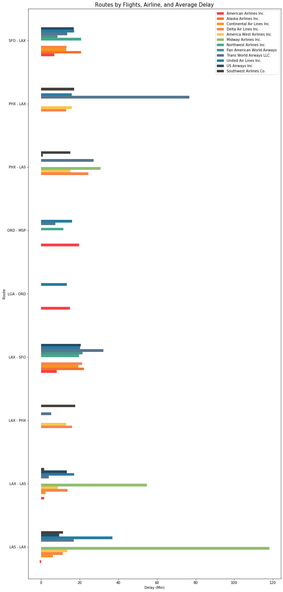


```python
# Plot
g = sns.catplot(data=carrier_ra_idx, kind='swarm', x='AverageDelay', y='Route', hue='description', height=10, s=9)
g._legend.set_title("Carriers")

# Show
#plt.tight_layout(pad=3)
plt.savefig('images/charts/routes_by_flights_airline_average_delay_2.png')
plt.show()
```


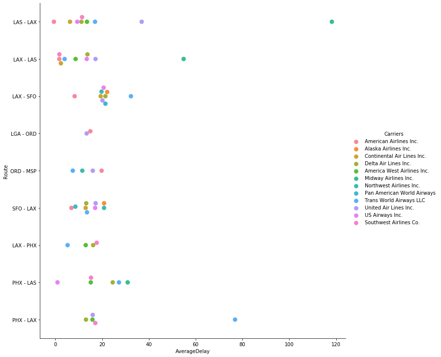


```python
# Filter route data
carrier_ra.filter(like='PHX - LAX', axis=0).sort_values(by='AverageDelay', ascending=False)
```


<div>
<style scoped>
    .dataframe tbody tr th:only-of-type {
        vertical-align: middle;
    }

    .dataframe tbody tr th {
        vertical-align: top;
    }

    .dataframe thead th {
        text-align: right;
    }
</style>
<table border="1" class="dataframe">
  <thead>
    <tr style="text-align: right;">
      <th></th>
      <th></th>
      <th>AverageDelay</th>
    </tr>
    <tr>
      <th>Carrier</th>
      <th>Route</th>
      <th></th>
    </tr>
  </thead>
  <tbody>
    <tr>
      <th>TW</th>
      <th>PHX - LAX</th>
      <td>76.833333</td>
    </tr>
    <tr>
      <th>WN</th>
      <th>PHX - LAX</th>
      <td>17.112161</td>
    </tr>
    <tr>
      <th>UA</th>
      <th>PHX - LAX</th>
      <td>16.000000</td>
    </tr>
    <tr>
      <th>HP</th>
      <th>PHX - LAX</th>
      <td>15.904401</td>
    </tr>
    <tr>
      <th>DL</th>
      <th>PHX - LAX</th>
      <td>13.126173</td>
    </tr>
  </tbody>
</table>
</div>


```python
carrier_ra.describe()
```


<div>
<style scoped>
    .dataframe tbody tr th:only-of-type {
        vertical-align: middle;
    }

    .dataframe tbody tr th {
        vertical-align: top;
    }

    .dataframe thead th {
        text-align: right;
    }
</style>
<table border="1" class="dataframe">
  <thead>
    <tr style="text-align: right;">
      <th></th>
      <th>AverageDelay</th>
    </tr>
  </thead>
  <tbody>
    <tr>
      <th>count</th>
      <td>57.000000</td>
    </tr>
    <tr>
      <th>mean</th>
      <td>18.367970</td>
    </tr>
    <tr>
      <th>std</th>
      <td>18.243396</td>
    </tr>
    <tr>
      <th>min</th>
      <td>-0.577778</td>
    </tr>
    <tr>
      <th>25%</th>
      <td>11.196488</td>
    </tr>
    <tr>
      <th>50%</th>
      <td>15.269559</td>
    </tr>
    <tr>
      <th>75%</th>
      <td>20.176455</td>
    </tr>
    <tr>
      <th>max</th>
      <td>118.200000</td>
    </tr>
  </tbody>
</table>
</div>


```python
# Difference between max delay and mean delay in %
carrier_ra.max()/carrier_ra.mean()*100
```


    AverageDelay    643.511507
    dtype: float64


**Observation 13:** LAS - LAX shows us many interesting insights. For example, American Airlines has the fewest delays on this route with an average delay of just -0.57 minutes, this means they are actually early. Midway Airlines Inc. has the most delays totalling an average of 118.2 minutes on this route which is astonishing. Things don't fair too well for Midway on the return leg with an average delay of 54.8 minutes. For PHX - LAX, Trans World Airways LLC tops the charts with an average of 76.8 minutes and Delta Air Lines Inc. has the fewest delays with just 13.1 minutes for delays on average. For our final conclusion, we can say the average delay time is just 18.36 minutes if all carriers and routes are considered which is pretty good. The outlier here is the maximum delay of 118 minutes which is 644% of the delay average of 18.36 minutes.

### 5.2. Top 10 Airlines by Average Delay


```python
# Dataframe from columns
top_10_carriers_by_delay = df8991['DepDelay']+df8991['ArrDelay']

# Creating a new dataframe
top_10_carriers_by_delay = pd.DataFrame(top_10_carriers_by_delay)

# Creating columns
top_10_carriers_by_delay['Carrier'] = df8991['UniqueCarrier']
top_10_carriers_by_delay.columns = ['AverageDelay','Carrier']
top_10_carriers_by_delay['DepDelay'] = df8991['DepDelay']
top_10_carriers_by_delay['ArrDelay'] = df8991['ArrDelay']

# Rename column for merge
top_10_carriers_by_delay = top_10_carriers_by_delay.rename(columns={"Carrier":"code"})

# Merge to get carrier names
top_10_carriers_by_delay = pd.merge(left=top_10_carriers_by_delay, right=carriers, how='left', on='code')
top_10_carriers_by_delay['Carrier'] = top_10_carriers_by_delay['description'].str.replace(r"\(.*\)","")
top_10_carriers_by_delay = top_10_carriers_by_delay.groupby(by='Carrier').mean().sort_values(by='AverageDelay', ascending=True)
top_10_carriers_by_delay
```


<div>
<style scoped>
    .dataframe tbody tr th:only-of-type {
        vertical-align: middle;
    }

    .dataframe tbody tr th {
        vertical-align: top;
    }

    .dataframe thead th {
        text-align: right;
    }
</style>
<table border="1" class="dataframe">
  <thead>
    <tr style="text-align: right;">
      <th></th>
      <th>AverageDelay</th>
      <th>DepDelay</th>
      <th>ArrDelay</th>
    </tr>
    <tr>
      <th>Carrier</th>
      <th></th>
      <th></th>
      <th></th>
    </tr>
  </thead>
  <tbody>
    <tr>
      <th>Northwest Airlines Inc.</th>
      <td>8.327834</td>
      <td>4.487461</td>
      <td>3.840373</td>
    </tr>
    <tr>
      <th>Pan American World Airways</th>
      <td>9.541804</td>
      <td>5.263768</td>
      <td>4.278036</td>
    </tr>
    <tr>
      <th>Alaska Airlines Inc.</th>
      <td>10.922795</td>
      <td>4.882948</td>
      <td>6.039847</td>
    </tr>
    <tr>
      <th>Midway Airlines Inc.</th>
      <td>10.940089</td>
      <td>6.192480</td>
      <td>4.747609</td>
    </tr>
    <tr>
      <th>American Airlines Inc.</th>
      <td>11.353261</td>
      <td>5.929751</td>
      <td>5.423510</td>
    </tr>
    <tr>
      <th>America West Airlines Inc.</th>
      <td>11.795458</td>
      <td>6.301721</td>
      <td>5.493738</td>
    </tr>
    <tr>
      <th>Continental Air Lines Inc.</th>
      <td>12.723660</td>
      <td>6.735197</td>
      <td>5.988463</td>
    </tr>
    <tr>
      <th>Trans World Airways LLC</th>
      <td>13.468342</td>
      <td>6.699408</td>
      <td>6.768934</td>
    </tr>
    <tr>
      <th>US Airways Inc.</th>
      <td>13.584921</td>
      <td>6.825033</td>
      <td>6.759888</td>
    </tr>
    <tr>
      <th>Southwest Airlines Co.</th>
      <td>14.058281</td>
      <td>7.946357</td>
      <td>6.111925</td>
    </tr>
    <tr>
      <th>Eastern Air Lines Inc.</th>
      <td>14.285615</td>
      <td>8.222712</td>
      <td>6.062903</td>
    </tr>
    <tr>
      <th>Delta Air Lines Inc.</th>
      <td>15.099069</td>
      <td>6.969973</td>
      <td>8.129096</td>
    </tr>
    <tr>
      <th>United Air Lines Inc.</th>
      <td>16.953211</td>
      <td>8.579475</td>
      <td>8.373736</td>
    </tr>
    <tr>
      <th>Piedmont Aviation Inc.</th>
      <td>25.816885</td>
      <td>11.974005</td>
      <td>13.842880</td>
    </tr>
  </tbody>
</table>
</div>


```python
# Plot
top_10_carriers_by_delay.plot(kind='barh', figsize=(7,10)) 

# Title
plt.title('Airlines by Average Delay', fontsize=15)

# Label
plt.xlabel('Delay in Minutes (Lower is better)', fontsize=13)

# Plot
plt.savefig('images/charts/airlines_by_average_delays.png')
plt.show()
```


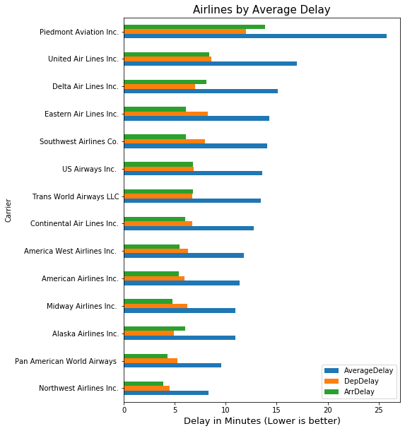


```python
# Departure delays vs Arrival delays % difference
top_10_carriers_by_delay['DepDelay'].mean()/top_10_carriers_by_delay['ArrDelay'].mean()-1
```


    0.05605593713455348


```python
# Percent change of delay between top 10 airlines
top_10_carriers_by_delay.pct_change()
```


<div>
<style scoped>
    .dataframe tbody tr th:only-of-type {
        vertical-align: middle;
    }

    .dataframe tbody tr th {
        vertical-align: top;
    }

    .dataframe thead th {
        text-align: right;
    }
</style>
<table border="1" class="dataframe">
  <thead>
    <tr style="text-align: right;">
      <th></th>
      <th>AverageDelay</th>
      <th>DepDelay</th>
      <th>ArrDelay</th>
    </tr>
    <tr>
      <th>Carrier</th>
      <th></th>
      <th></th>
      <th></th>
    </tr>
  </thead>
  <tbody>
    <tr>
      <th>Northwest Airlines Inc.</th>
      <td>NaN</td>
      <td>NaN</td>
      <td>NaN</td>
    </tr>
    <tr>
      <th>Pan American World Airways</th>
      <td>0.145773</td>
      <td>0.172995</td>
      <td>0.113964</td>
    </tr>
    <tr>
      <th>Alaska Airlines Inc.</th>
      <td>0.144731</td>
      <td>-0.072347</td>
      <td>0.411827</td>
    </tr>
    <tr>
      <th>Midway Airlines Inc.</th>
      <td>0.001583</td>
      <td>0.268185</td>
      <td>-0.213952</td>
    </tr>
    <tr>
      <th>American Airlines Inc.</th>
      <td>0.037767</td>
      <td>-0.042427</td>
      <td>0.142367</td>
    </tr>
    <tr>
      <th>America West Airlines Inc.</th>
      <td>0.038949</td>
      <td>0.062729</td>
      <td>0.012949</td>
    </tr>
    <tr>
      <th>Continental Air Lines Inc.</th>
      <td>0.078691</td>
      <td>0.068787</td>
      <td>0.090053</td>
    </tr>
    <tr>
      <th>Trans World Airways LLC</th>
      <td>0.058527</td>
      <td>-0.005314</td>
      <td>0.130329</td>
    </tr>
    <tr>
      <th>US Airways Inc.</th>
      <td>0.008656</td>
      <td>0.018752</td>
      <td>-0.001336</td>
    </tr>
    <tr>
      <th>Southwest Airlines Co.</th>
      <td>0.034845</td>
      <td>0.164296</td>
      <td>-0.095854</td>
    </tr>
    <tr>
      <th>Eastern Air Lines Inc.</th>
      <td>0.016171</td>
      <td>0.034778</td>
      <td>-0.008021</td>
    </tr>
    <tr>
      <th>Delta Air Lines Inc.</th>
      <td>0.056942</td>
      <td>-0.152351</td>
      <td>0.340793</td>
    </tr>
    <tr>
      <th>United Air Lines Inc.</th>
      <td>0.122798</td>
      <td>0.230919</td>
      <td>0.030094</td>
    </tr>
    <tr>
      <th>Piedmont Aviation Inc.</th>
      <td>0.522832</td>
      <td>0.395657</td>
      <td>0.653131</td>
    </tr>
  </tbody>
</table>
</div>


**Observation 14:** Northwest Airlines has the lowest average delay on flights for departure and arrival times combined. Piedmont Aviation is the least punctual carrier with almost 26 minutes average delay times with a 52% increased average delay time vs Northwest Airlines. Another trend we can notice is that departure delays are 5% higher than arrival delays on average suggesting various factors cause this like aircraft prepeation and passengers.

<a id='random'></a>
## Step 6: Random Exploration 🔀

### 6.1. Plane Data

We can round off our exploration by looking at the `plane_data` table. There we can find data about plane types, manufacturers, models, engine types and issue dates.


```python
plane_data.head()
```


<div>
<style scoped>
    .dataframe tbody tr th:only-of-type {
        vertical-align: middle;
    }

    .dataframe tbody tr th {
        vertical-align: top;
    }

    .dataframe thead th {
        text-align: right;
    }
</style>
<table border="1" class="dataframe">
  <thead>
    <tr style="text-align: right;">
      <th></th>
      <th>tailnum</th>
      <th>type</th>
      <th>manufacturer</th>
      <th>issue_date</th>
      <th>model</th>
      <th>status</th>
      <th>aircraft_type</th>
      <th>engine_type</th>
      <th>year</th>
    </tr>
  </thead>
  <tbody>
    <tr>
      <th>0</th>
      <td>N10156</td>
      <td>Corporation</td>
      <td>EMBRAER</td>
      <td>02/13/2004</td>
      <td>EMB-145XR</td>
      <td>Valid</td>
      <td>Fixed Wing Multi-Engine</td>
      <td>Turbo-Fan</td>
      <td>2004</td>
    </tr>
    <tr>
      <th>1</th>
      <td>N102UW</td>
      <td>Corporation</td>
      <td>AIRBUS INDUSTRIE</td>
      <td>05/26/1999</td>
      <td>A320-214</td>
      <td>Valid</td>
      <td>Fixed Wing Multi-Engine</td>
      <td>Turbo-Fan</td>
      <td>1998</td>
    </tr>
    <tr>
      <th>2</th>
      <td>N10323</td>
      <td>Corporation</td>
      <td>BOEING</td>
      <td>07/01/1997</td>
      <td>737-3TO</td>
      <td>Valid</td>
      <td>Fixed Wing Multi-Engine</td>
      <td>Turbo-Jet</td>
      <td>1986</td>
    </tr>
    <tr>
      <th>3</th>
      <td>N103US</td>
      <td>Corporation</td>
      <td>AIRBUS INDUSTRIE</td>
      <td>06/18/1999</td>
      <td>A320-214</td>
      <td>Valid</td>
      <td>Fixed Wing Multi-Engine</td>
      <td>Turbo-Fan</td>
      <td>1999</td>
    </tr>
    <tr>
      <th>4</th>
      <td>N104UA</td>
      <td>Corporation</td>
      <td>BOEING</td>
      <td>01/26/1998</td>
      <td>747-422</td>
      <td>Valid</td>
      <td>Fixed Wing Multi-Engine</td>
      <td>Turbo-Fan</td>
      <td>1998</td>
    </tr>
  </tbody>
</table>
</div>


```python
# Remove entries titled 'None' from year column
plane_data = plane_data[~plane_data['year'].isin(['None'])]

# Changing 'year' datatype from string to integer
plane_data['year'] = plane_data['year'].astype('int')

# Filtering years 1989 to 1991 and assigning to new df
plane_data_8991 = plane_data[(plane_data['year'] >= 1989) & (plane_data['year'] <= 1991)]
```


```python
# Most popular aircraft manufacturers between 89-91
plane_data_8991['manufacturer'].value_counts().iloc[0:10].sort_values(ascending=True).plot(kind='barh', figsize=(10,10))

# Title
plt.title('Most Popular Aircraft Manufacturers from 1989-1991', fontsize=15)

# Label
plt.xlabel('Total Aircraft', fontsize=13)

# Plot
plt.savefig('images/charts/top_manufacturers.png')
plt.show()
```


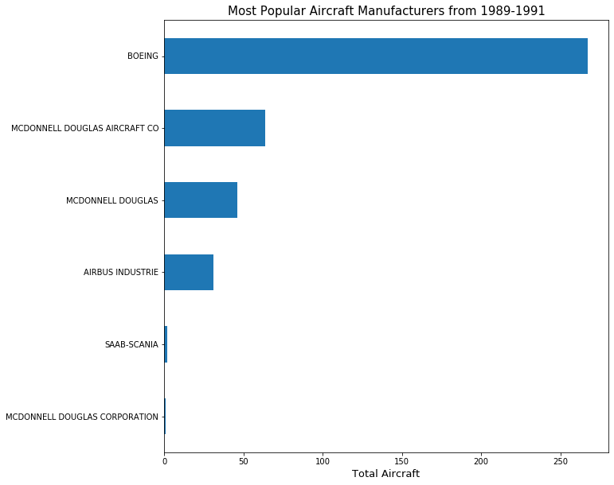


```python
# Top manufacturers
plane_data_8991['manufacturer'].value_counts().iloc[0:10].sort_values(ascending=False)
```


    BOEING                           267
    MCDONNELL DOUGLAS AIRCRAFT CO     64
    MCDONNELL DOUGLAS                 46
    AIRBUS INDUSTRIE                  31
    SAAB-SCANIA                        2
    MCDONNELL DOUGLAS CORPORATION      1
    Name: manufacturer, dtype: int64


```python
# Market share
plane_data_8991['manufacturer'].value_counts(normalize=True)
```


    BOEING                           0.649635
    MCDONNELL DOUGLAS AIRCRAFT CO    0.155718
    MCDONNELL DOUGLAS                0.111922
    AIRBUS INDUSTRIE                 0.075426
    SAAB-SCANIA                      0.004866
    MCDONNELL DOUGLAS CORPORATION    0.002433
    Name: manufacturer, dtype: float64


```python
# Most popular aircraft maodels between 89-91
plane_data_8991['model'].value_counts().iloc[0:10].sort_values(ascending=True).plot(kind='barh', figsize=(10,10))

# Title
plt.title('Most Popular Aircraft Models from 1989-1991', fontsize=15)

# Label
plt.xlabel('Total Aircraft', fontsize=13)

# Plot
plt.savefig('images/charts/top_models.png')
plt.show()
```


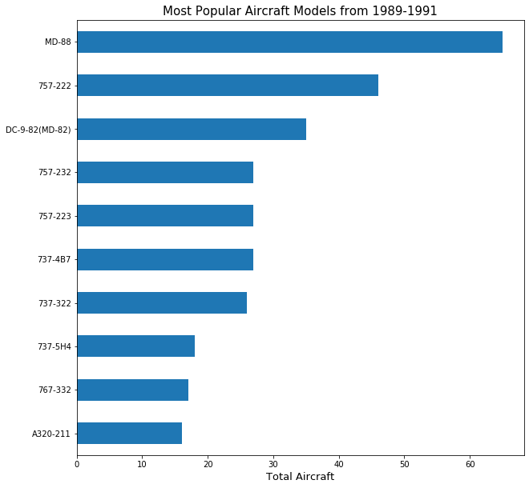


```python
# Top 10 aircraft from 89-91
plane_data_8991['model'].value_counts().iloc[0:10].sort_values(ascending=False)
```


    MD-88             65
    757-222           46
    DC-9-82(MD-82)    35
    757-232           27
    757-223           27
    737-4B7           27
    737-322           26
    737-5H4           18
    767-332           17
    A320-211          16
    Name: model, dtype: int64


```python
# Percent change between values
plane_data_8991['model'].value_counts().iloc[0:10].sort_values(ascending=False).pct_change()
```


    MD-88                  NaN
    757-222          -0.292308
    DC-9-82(MD-82)   -0.239130
    757-232          -0.228571
    757-223           0.000000
    737-4B7           0.000000
    737-322          -0.037037
    737-5H4          -0.307692
    767-332          -0.055556
    A320-211         -0.058824
    Name: model, dtype: float64


```python
# Most popular engine types between 89-91
plane_data_8991['engine_type'].value_counts().iloc[0:10].sort_values(ascending=True).plot(kind='barh', figsize=(10,10))

# Title
plt.title('Most Engine Types from 1989-1991', fontsize=15)

# Label
plt.xlabel('Total Engines', fontsize=13)

# Plot
plt.savefig('images/charts/top_engine_types.png')
plt.show()
```


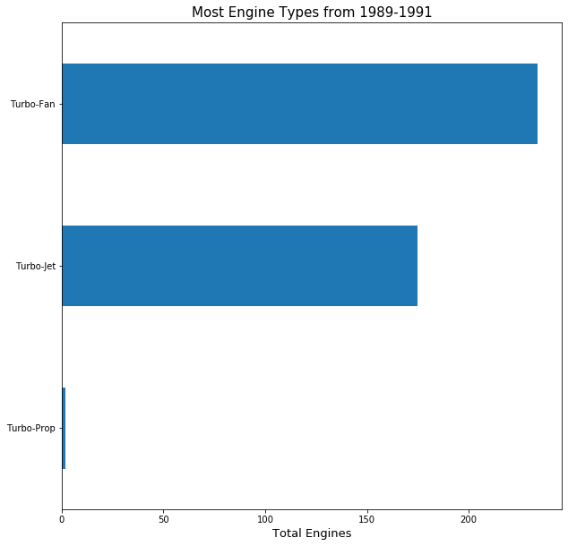


```python
plane_data_8991['engine_type'].value_counts().iloc[0:10].sort_values(ascending=False)
```


    Turbo-Fan     234
    Turbo-Jet     175
    Turbo-Prop      2
    Name: engine_type, dtype: int64


**Observation 1:** Boeing is by far the most popular aircraft manufacturer between 1989 and 1991 with 267 aircraft totalling 65% of the market. The top 6 is rounded out by McDonnel Douglas and Airbus Industrie while SAAB-Scania and MD Corporation rank 5th and 6th. Interestingly, despite Boeing's dominance the most popular aircraft is a McDonnel Douglas MD-88 with 65 aircraft recorded over our 3 year sample. The rest of the top 10 is dominated by 7 Boeing aircraft, 3rd spot is filled by a McDonnel Douglas DC-9 and 10th is taken by an Airbus A320-211. Finally on engine types, the most common engine type is Turbo-Fan with 234 records, followed by Turbo-Jet with 175 then Turbo-Prop with just 2 records.

<a id='conclusion'></a>
## Step 7: Conclusion 📝

### 7.1. Interesting Findings

From our data, we can assess passengers fly more during the summer and least during the winter and more during midweek versus the weekend. The most popular time to travel for passengers is in the morning around 8:00. Most flights average a 110 minute flight time and an average distance is 632 miles. Interestingly, the average distance for flights increases during the winter months suggesting that passengers commute further to go on distant holidays or visit family and friends across the country. Airline carriers enjoy a competitive market with no more than 36% difference in total flights between carriers. Regarding carriers, we observed that flight delays increase with flight distance. Chicago O'Hare International is the busiest airport with over 1.5 million flights recorded over the 3 year period.

### 7.2. Project Answers

**How many flights are there?**\
15,031,014 flights.

**Which airlines have the most flights?**\
US Airways Inc.

**What time of the week passengers fly the most?**\
Monday to Friday.

**How does season change the frequency and the destination of travel?**\
Summer increases the frequency of average flights whilst winter decreases it.

**Which routes are the most popular?**
1. SFO - LAX | 69,180 Flights 
2. LAX - SFO | 68,754 Flights
3. LAX - PHX | 39,321 Flights

*LAX: Los Angeles Intl, SFO: San Fransisco Intl, PHX: Phoenix Sky Harbor Intl.*

**Which routes and airports experience the most delays?**\
GUC - HDN Gunisson to Haydon | 1980 minutes on average for route.\
PSE Mercedita Airport | 53.25 minutes delay on average is the highest for an airport.\
BQN Rafael Hernández Airport | -10.35 minutes delay (early) on average is lowest for an airport.

**Which airports are the busiest in terms of inbound and outbound flights?**\
Chicago O'Hare International.

**Which popular routes are delayed the most?**\
LAX - SFO |	68,754 Flights, 18.97 minutes delay on average.\
PHX - LAX |	38,756 Flights, 16.18 minutes delay on average.\
PHX - LAS |	30,778 Flights, 15.85 minutes delay on average.

**Which times are airports the busiest in terms of flights by each hour?**\
08:00 - 09:00 has over 1 million flights during the morning.

**How does flight distance affect departure and arrival delays?**\
Flight distance increases total departure and arrival delays with 0.221398 positive correlation.

**Which airline experiences the fewest delays?**\
Northwest Airlines.

#### References
Getting csv subdirectories: https://perials.com/getting-csv-files-directory-subdirectories-using-python/ \
Combine csv files: https://www.freecodecamp.org/news/how-to-combine-multiple-csv-files-with-8-lines-of-code-265183e0854/ \
Fix .info() display: https://www.geeksforgeeks.org/python-pandas-dataframe-info/ \
CMD: https://www.tomnash.eu/how-to-combine-multiple-csv-files-into-one-using-cmd/ \
Reset and drop index: https://stackoverflow.com/questions/39616424/pandas-reset-index-creating-level0-column \
Between values 1: https://stackoverflow.com/questions/31617845/how-to-select-rows-in-a-dataframe-between-two-values-in-python-pandas \
Between values 2: https://www.geeksforgeeks.org/python-pandas-series-between/ \
String Pad or str.pad: https://www.geeksforgeeks.org/python-pandas-series-str-pad/ \
String Slicing: https://geekflare.com/python-remove-last-character/ \
Datetime without date: https://stackoverflow.com/questions/32375471/pandas-convert-strings-to-time-without-date# \
Replace values: https://datatofish.com/replace-values-pandas-dataframe/ \
Dates to seasons: https://stackoverflow.com/questions/22615288/group-data-by-seasons-using-python-and-pandas \
Rename Index: https://pandas.pydata.org/pandas-docs/stable/reference/api/pandas.DataFrame.rename_axis.html \
Sort Index by list: https://stackoverflow.com/questions/45389126/sort-index-by-list-python-pandas \
Loc: https://www.geeksforgeeks.org/python-pandas-dataframe-loc/ \
DT Day of Week: https://pandas.pydata.org/pandas-docs/stable/reference/api/pandas.Series.dt.dayofweek.html \
Pandas Interate Dataframe: https://pythonbasics.org/pandas-iterate-dataframe/ \
Strip strings inside bracket: https://stackoverflow.com/questions/20894525/how-to-remove-parentheses-and-all-data-within-using-pandas-python \
Adding colour to pie charts: https://www.pythonprogramming.in/how-to-pie-chart-with-different-color-themes-in-matplotlib.html \
Using axvline to add average line: https://stackoverflow.com/questions/45724329/let-axvline-end-at-certain-y-value \
Plot MultiIndex = https://stackoverflow.com/questions/54451127/creating-a-heatmap-from-a-pandas-multiindex-series \
Modify sns heatmaps: https://stackoverflow.com/questions/42712304/seaborn-heatmap-subplots-keep-axis-ratio-consistent \
Marker styles: https://matplotlib.org/3.1.1/api/markers_api.html \
Sum text columns: https://cmdlinetips.com/2018/11/how-to-join-two-text-columns-into-a-single-column-in-pandas/ \
Melting Dataframe: https://pandas.pydata.org/docs/reference/api/pandas.melt.html \
Concat Dataframe: https://www.geeksforgeeks.org/python-pandas-merging-joining-and-concatenating/ \
Change Seaborn plot size: https://stackoverflow.com/questions/31594549/how-do-i-change-the-figure-size-for-a-seaborn-plot \
Rename Seaborn legend: https://stackoverflow.com/questions/53116532/modify-seaborn-line-relplot-legend-title \
Rename Columns: https://chartio.com/resources/tutorials/how-to-rename-columns-in-the-pandas-python-library/ \
Plot 3 variable bar chart: https://stackoverflow.com/questions/42128467/matplotlib-plot-multiple-columns-of-pandas-data-frame-on-the-bar-chart \
Filter DF between two values: https://stackoverflow.com/questions/31617845/how-to-select-rows-in-a-dataframe-between-two-values-in-python-pandas/40442778 \
Drop row with matching value or string: https://stackoverflow.com/questions/28679930/how-to-drop-rows-from-pandas-data-frame-that-contains-a-particular-string-in-a-p


```python

```
